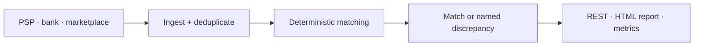

# Backend systems where money and records have to stay correct

**Reconciliation · payment and bank integrations · privacy-compliant data handling · rescuing
inherited systems**

I build backend systems for the places where the payment, the invoice and the record have to agree.
The work has a common shape: money or records are going missing somewhere, nobody can point at
exactly where, and every month closed by hand costs both money and risk.

### Three things that are hard to fake

- **I have owned a whole product alone.** Sole technical ownership of a live, multi-tenant commercial
  SaaS that takes payments, processes personal data and runs a GPU/ML workload — architecture,
  API, web, release process, compliance documentation and the handover package.
- **I found a real defect in code that top firms had already audited.** A deterministic correctness
  defect in ERC-4337 EntryPoint v0.8, reproduced twice: once with a negative-controlled proof, once
  on an independently pinned second environment.
- **I stopped a ~$16.7M finding because my own evidence refuted it.** After ~45M blocks of on-chain
  forensics and a pinned-block proof, the leading hypothesis did not hold. Nothing was submitted.
  I would rather report a defensible nothing than a plausible something.

The third one is the one worth hiring for. Everything I claim in this portfolio can be checked, and
the parts that cannot be checked are labelled as such.

> ### Available for fixed-scope engagements
>
> Send the problem, the current system and the outcome you expect. You get the scope, the timeline
> and the deliverables back in writing. The first call and the initial assessment are free.
>
> **[Email me →](mailto:hilberspace@gmail.com)**

📍 Türkiye · working with companies in Türkiye and internationally ·
[GitHub profile](https://github.com/hilberspace-dev) ·
[**🇹🇷 Türkçe portföy**](README.tr.md)

---

## Problems I solve

**"The PSP report, the bank statement and the marketplace settlement do not agree."**
Three sources describe the same money in different ways. Manual reconciliation carries two silent
risks: records that match by coincidence, and records that fall out of the remainder and disappear.
I build systems around deterministic matching, where every unmatched record lands in a named
category and the run stops rather than producing a result when a correctness invariant is violated.

**"The team that wrote it left, and nobody dares touch it."**
Systems with no tests, no documentation, and a breakage somewhere on every change. The first job is
to pin the behaviour: tests that capture what it does today, explicit invariants, and only then
controlled change. What I hand back is not a system that runs — it is a system somebody else can
take over.

**"We cannot produce evidence for a privacy or compliance audit."**
Where a product touches personal data, retention, consent, erasure and access controls have to be
executable, not merely written down. I have built compliance checks that run automatically and
produce their own evidence, which is the difference between an audit and a week spent collecting
screenshots.

| | Product companies and scale-ups | Enterprise and group structures |
| --- | --- | --- |
| **Typical need** | One critical problem solved quickly and permanently, without growing the internal team | A defined work package that touches existing systems and stays auditable and transferable |
| **Engagement** | Fixed scope, fixed price, one point of contact | Defined package, written acceptance criteria, NDA, documented process |
| **What you get** | Working system, tests, and how to operate it | The above plus decision records, runbooks, a handover package and audit evidence |

---

## How I work, in writing

Two methodology documents live in this repository. They are not marketing pages; they are the
standards I actually hold myself to, and they are the fastest way to judge whether I am the right
person for your work.

- **[Delivery & Quality-Gate Methodology](DELIVERY-METHODOLOGY.md)** — how a change reaches
  production: the gate ladder, how legacy debt is frozen and forced downward, tests that detect
  rather than tests that merely execute, contract discipline, release verification and rollback.
- **[Security Review & Proof-of-Concept Methodology](METHODOLOGY.md)** — how a defect is proven:
  invariant specification, adversarial review from multiple angles, the five-link chain a finding
  must satisfy, and triager-ready packaging.

Both rest on the same principle: **evidence before assertions.** Nothing is called fixed, passing or
done without the command, its output and its exit code — and anything that was not run gets said out
loud.

---

## Selected work

### 1. Aura — Photoreal 3D Surgical-Preview & Clinic Platform *(private, commercial)*

[Case study](projects/04-aura-photoreal-3d-clinic-platform/) ·
[**🇹🇷 Türkçe oku**](projects/04-aura-photoreal-3d-clinic-platform/README.tr.md)

**Situation.** Turn patient-specific visual simulation and day-to-day clinic operations into one
commercial product without weakening patient-adjacent data handling.

**What I did.** Sole technical ownership across the product, web application, API and GPU/ML
workloads: multi-tenant architecture, payment flow, privacy controls, automated quality gates, and
the release and deployment process.

**Outcome.** A clinic-ready commercial product with privacy controls and an operational handover
package. Source and implementation-specific client IP remain private; the case study documents
responsibilities and non-sensitive evidence only.

`TypeScript` `React` `Node.js` `multi-tenant SaaS` `payments` `privacy compliance` `GPU/ML` `automated testing`

### 2. ReconPilot — Deterministic payment reconciliation engine

[Case study](projects/03-reconpilot-payment-reconciliation/) ·
[**🇹🇷 Türkçe oku**](projects/03-reconpilot-payment-reconciliation/README.tr.md) ·
[Public source, tests and benchmark](https://github.com/hilberspace-dev/reconpilot) ·

**Situation.** PSP reports, bank statements and marketplace settlements describe the same money in
different ways, and manual reconciliation produces both false matches and silent losses.

**What I did.** A Go/PostgreSQL service that ingests and deduplicates all three sources, applies a
deterministic exact → tolerant → group matching chain, classifies every unmatched record, and
hard-fails instead of continuing quietly when its correctness invariants are violated.

**Outcome.** Its seeded synthetic benchmark reconciles ~50K transactions in ~4 seconds: **7/7
injected discrepancy types detected, 0 false matches, 0 intended pairs or groups missed.** Within
that scope no record silently disappears, and manual investigation starts from a named discrepancy
category rather than an untraceable remainder. *(The figures come from an open synthetic dataset,
not production data, and you can reproduce them yourself.)*

*Golden-dataset HTML report — click to inspect the full-size image.*

`Go` `PostgreSQL` `REST` `Prometheus` `Docker Compose` `property-based testing` `CI`

### 3. Independent security reviews

Two reviews of code that moves money or assets, each checked against its own documented rules. Both
show the same discipline: a finding that cannot be proven does not get reported.

**ERC-4337 EntryPoint v0.8 review** — a Low-severity deterministic correctness defect in a heavily
audited component, reproduced twice: once with a negative-controlled proof, once on a digest-pinned
second environment. It was not submitted or externally validated; the mechanism remains withheld
while unfixed upstream.
[Case study](projects/02-erc4337-entrypoint-review/)

**Live-protocol audit (~$16.7M) — a disciplined NO-GO** — on-chain forensics across ~45M blocks,
deployed-bytecode verification, a 14-invariant specification and a pinned-block proof. The leading
hypothesis was reproduced, then refuted by its own evidence. Nothing was submitted.
[Case study](projects/01-smart-contract-security-audit/)

---

## How we work together

1. **Initial assessment (free).** We go through the problem, the current system and the outcome you
   need. If it is not the right job for me, you hear that on the first call.
2. **Written scope.** What is included, what is not, the acceptance criteria, the timeline and a
   fixed price. Out-of-scope work does not arrive later as a surprise.
3. **Incremental delivery.** Working results in pieces, with what was run and what it returned
   shared in writing at every step.
4. **Verification.** Tests, reproducible checks and — where the work calls for it — negative
   controls that try to refute my own claim.
5. **Handover.** Documentation, runbooks and, where needed, a session with your team. I do not leave
   behind a system that depends on me.

**Confidentiality.** I work under NDA. Client source code and data never appear in any portfolio
document, which is why the commercial case study here describes responsibilities and non-sensitive
evidence only.

---

## Technical scope

**Core:** Go · PostgreSQL · Node.js / TypeScript · backend architecture · payment and transaction
systems · reconciliation · API integrations · automated testing and CI · Docker · observability

**Additional experience:** React · .NET · computer vision and GPU workloads · Solidity / EVM

**Working language.** Turkish for projects in Türkiye; professional written English for
specifications, tickets, documentation and code review. Async-first collaboration.

---

## Contact

[Email me](mailto:hilberspace@gmail.com) for fixed-scope work. Include these and you get a scope and
timeline estimate on the first reply:

- the problem, and how it is being handled today
- the current system and stack
- the expected deliverable
- the target timeline
- access constraints (repository, environments, NDA)

---

*This is a curated portfolio published after the underlying work was completed. Commit dates reflect
publication and documentation history, not the original development timeline.*
