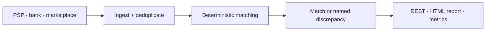

# atilgandev — Backend Engineer for Payment & Data-Integrity Systems

**Go · PostgreSQL · reconciliation · high-integrity software**

I build backend systems for product companies and software agencies where money and records must
remain correct, explainable and recoverable.

> **Available for fixed-scope B2B engagements with product companies and software agencies.**
>
> Send the problem, current stack, expected deliverable and timeline → [email me](mailto:hilberspace@gmail.com).

Async-first collaboration with professional written English for specifications, tickets,
documentation and code review.

📍 Türkiye · [GitHub profile](https://github.com/hilberspace-dev) ·
[Türkçe özet](README.tr.md)

## Services

- **Payment reconciliation and financial-data systems** — PSP, bank and marketplace integrations,
  deterministic matching, discrepancy classification and reporting.
- **Go/PostgreSQL backend reliability** — schema invariants, idempotency, APIs, automated tests, CI
  and observability.
- **Scoped backend subcontract delivery for software agencies** — a defined ticket or specification
  delivered independently with tests, evidence, documentation and handover.

Evidence-backed delivery: reproducible tests, explicit invariants, negative controls where
applicable and documented results.

---

## Featured project — ReconPilot

### Deterministic payment reconciliation engine

[Case study](projects/03-reconpilot-payment-reconciliation/) ·
[**🇹🇷 Türkçe oku**](projects/03-reconpilot-payment-reconciliation/README.tr.md) ·
[Public source, tests and benchmark](https://github.com/hilberspace-dev/reconpilot) ·

**Problem.** PSP reports, bank statements and marketplace settlements describe the same money in
different ways. Manual reconciliation creates two silent risks: coincidental false matches and
records that disappear from the remainder.

**Delivered solution.** A Go/PostgreSQL service that ingests and deduplicates all three sources,
applies a deterministic exact → tolerant → group matching chain, classifies every unmatched record
and hard-fails when its correctness invariants are violated.

**Business outcome.** Its seeded synthetic benchmark reconciles ~50K transactions in ~4 seconds:
**7/7 injected discrepancy types detected, 0 false matches and 0 intended pairs/groups missed**.
Within that benchmarked scope, no record silently disappears from the result; manual investigation
starts from an explicit discrepancy category instead of an untraceable remainder.

*Golden-dataset HTML report — click to inspect the full-size image.*

**Delivered**

- Go service with versioned REST, server-rendered HTML, health/readiness and Prometheus metrics
- PostgreSQL schema and migrations with constraints for deduplication and match integrity
- Integration and property-based tests, Docker Compose, CI, ADRs and operational documentation

**Related engagements:** PSP/bank/marketplace integrations · reconciliation engines · transaction
deduplication · financial reporting backends · data-integrity audits

`Go` `PostgreSQL` `REST` `Prometheus` `Docker Compose` `property-based testing` `testcontainers` `CI`

---

## Commercial work

### Aura — Photoreal 3D Surgical-Preview & Clinic Platform *(private, commercial)*

[Case study](projects/04-aura-photoreal-3d-clinic-platform/) ·
[**🇹🇷 Türkçe oku**](projects/04-aura-photoreal-3d-clinic-platform/README.tr.md)

**Problem.** Turn patient-specific visual simulation and day-to-day clinic operations into one
commercial product without compromising patient-adjacent data handling.

**Delivered solution.** Sole technical ownership across the product, web application, API and
GPU/ML workloads, including a patient-specific preview experience and the surrounding clinic
workflow.

**Business outcome.** A clinic-ready commercial product with privacy controls and an operational
handover package. Source and implementation-specific client IP remain private; the case study
documents responsibilities and non-sensitive evidence only.

**Delivered**

- Full-stack product, API and GPU/ML workload integration
- Automated controls around output consistency, payments, privacy and accessibility
- Release scripts, runbooks, compliance documentation and source-code handover package

`TypeScript` `React` `Node.js` `computer vision` `GPU workloads` `automated testing` `KVKK`

---

## Security research

### ERC-4337 EntryPoint v0.8 — Security Review

[Case study](projects/02-erc4337-entrypoint-review/) ·
[**🇹🇷 Türkçe oku**](projects/02-erc4337-entrypoint-review/README.tr.md)

**Problem.** Test a heavily audited account-abstraction component against its own documented
correctness rules.

**Delivered.** An independent source-level review, a negative-controlled proof and a second
reproduction on a digest-pinned Prague client.

**Outcome.** One Low-severity deterministic correctness defect reproduced in two environments. It
was not submitted or externally validated; the mechanism remains withheld while unfixed upstream.

`Solidity` `Hardhat` `TypeScript` `ERC-4337` `EIP-7702`

### Live-Protocol Audit (~$16.7M) — Disciplined NO-GO

[Case study](projects/01-smart-contract-security-audit/) ·
[**🇹🇷 Türkçe oku**](projects/01-smart-contract-security-audit/README.tr.md)

**Problem.** Determine whether a suspected weakness in a live protocol warranted a responsible
submission.

**Delivered.** On-chain forensics across ~45M blocks, deployed-bytecode verification, a
14-invariant specification and a pinned-block Foundry proof.

**Outcome.** The leading hypothesis was reproduced, then refuted by its own evidence. Nothing was
submitted; the recommendation was to stop and redirect effort rather than overclaim a finding.

`Solidity` `Foundry` `EVM fork testing` `JSON-RPC forensics`

---

## Engineering process

1. Scope and acceptance criteria
2. Written technical plan
3. Incremental implementation
4. Tests and reproducible verification
5. Documentation and handover

I take a scoped ticket or specification, work independently and return a reviewable result with its
tests and evidence. For adversarial security review and proof packaging, see the detailed
[Security Review & Proof-of-Concept Methodology](METHODOLOGY.md).

## Technical skills

**Core:** Go · PostgreSQL · backend architecture · payment and transaction systems · API
integrations · testing and CI · Docker · observability

**Additional experience:** TypeScript / Node.js · .NET · React · computer vision and GPU workloads ·
Solidity / EVM

## Contact

For fixed-scope B2B work with a product company or software agency,
[email me](mailto:hilberspace@gmail.com) with:

- the problem to solve
- the current stack
- the expected deliverable
- the target timeline
- repository or access constraints

Async-first collaboration; professional written English for specifications, tickets,
documentation and code review.

---

*This is a curated portfolio published after the underlying work was completed. Commit dates
reflect publication and documentation history, not the original development timeline.*
