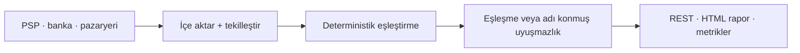

# Para ve kayıt doğruluğunun kritik olduğu backend sistemleri

**Mutabakat · ödeme ve banka entegrasyonları · KVKK uyumlu veri işleme · devralınan sistemlerin
toparlanması**

Ödemenin, faturanın ve kaydın tutması gereken yerlerde backend geliştiriyorum. Çalıştığım işlerin
ortak paydası şu: bir yerde para veya kayıt kayboluyor, kimse tam olarak nerede olduğunu
gösteremiyor ve elle kapatılan her ay hem maliyet hem risk üretiyor.

### Taklit edilmesi zor üç şey

- **Bir ürünün tamamını tek başıma taşıdım.** Ödeme alan, kişisel veri işleyen ve GPU/ML workload'u
  koşan canlı, multi-tenant ticari bir SaaS'ın tek teknik sahibiydim: mimari, API, web, release
  süreci, KVKK dokümantasyonu ve handover paketi.
- **Başkalarının zaten incelediği para koduna hata bulurum.** ERC-4337 EntryPoint v0.8'de — işlem
  doğrulayan ve ödemesini yapan, yoğun biçimde denetlenmiş bir bileşen — deterministik bir doğruluk
  kusurunu iki kez tekrar ürettim: biri negatif kontrollü kanıtla, diğeri bağımsız olarak sabitlenmiş
  ikinci bir ortamda. Bir mutabakat defterine ya da bir ödeme callback'ine de aynı yöntemle bakarım.
- **Kanıt "dur" diyorsa dururum.** ~16,7M $'lık bir inceleme, kendi kanıtım en güçlü hipotezimi
  çürüttüğü için yazılı bir NO-GO ile bitti. Hiçbir bildirim gönderilmedi. Sayılar umduğunuz sonucu
  desteklemiyorsa, bunu ilk benden duyarsınız.

Asıl işe alınması gereken üçüncüsü. Bu portföydeki her iddia kontrol edilebilir; kontrol
edilemeyecek olanlar da öyle olduğu yazılarak işaretlenmiştir.

> ### Sabit kapsamlı iş alıyorum
>
> Problemi, mevcut sistemi ve beklediğiniz sonucu yazın; kapsamı, süreyi ve teslim edilecekleri
> yazılı olarak geri göndereyim. İlk görüşme ve ön değerlendirme ücretsizdir.
>
> **[E-posta gönderin →](mailto:hilberspace@gmail.com)**

**atilgandev** · 📍 Türkiye · Türkçe yürütülen projeler, Türkçe dokümantasyon ·
[GitHub profili](https://github.com/hilberspace-dev) ·
[English portfolio](README.md)

---

## Hangi problemleri çözüyorum

**"PSP raporu, banka ekstresi ve pazaryeri hakedişi birbirini tutmuyor."**
Üç kaynak aynı parayı farklı anlatır. Elle mutabakatta iki sessiz risk vardır: tesadüfen eşleşen
yanlış kayıtlar ve kalan listesinden düşüp kaybolan işlemler. Deterministik eşleştirme, her
eşleşmeyen kaydın adlandırılmış bir sınıfa düşmesi ve ihlal hâlinde sonucu üretmek yerine durması
üzerine kurulu sistemler yazıyorum.

**"Sistemi yazan ekip gitti, kimse dokunmaya cesaret edemiyor."**
Testi olmayan, dokümante edilmemiş, her değişiklikte bir yeri kıran sistemler. Yaptığım iş önce
davranışı pinlemek: mevcut davranışı yakalayan testler, açık invariant'lar, sonra kontrollü
değişiklik. Devrederken çalışan bir sistem değil, **devralınabilir** bir sistem bırakıyorum.

**"KVKK ve denetim tarafında kanıt üretemiyoruz."**
Kişisel veriye dokunan ürünlerde saklama, rıza, silme ve erişim kontrollerinin yalnızca yazılı
değil, **çalıştırılabilir** olması gerekiyor. Uyum kontrollerini otomatik koşan ve kanıtını üreten
sistemler kurdum; bu, denetim sırasında ekran görüntüsü toplamakla arasındaki farktır.

| | KOBİ ve büyüyen ürün şirketleri | Kurumsal ve holding yapıları |
| --- | --- | --- |
| **Tipik ihtiyaç** | Tek bir kritik problemin hızlı ve kalıcı çözümü; iç ekibi büyütmeden ilerlemek | Mevcut sisteme dokunan, denetlenebilir ve devredilebilir bir iş paketi |
| **Çalışma biçimi** | Sabit kapsam, sabit fiyat, tek muhatap | Tanımlı iş paketi, yazılı kabul kriterleri, NDA, süreç dokümanı |
| **Teslimde alınan** | Çalışan sistem + testler + nasıl işletileceği | Yukarıdakiler + ADR'ler, runbook, handover paketi, denetim kanıtı |

---

## Nasıl çalıştığım — yazılı olarak

Bu depoda iki metodoloji belgesi duruyor. Bunlar pazarlama sayfası değil; fiilen kendime
uyguladığım standartlar ve doğru kişi olup olmadığıma karar vermenin en hızlı yolu.

- **[Teslim ve Quality Gate Metodolojisi](DELIVERY-METHODOLOGY.tr.md)** — bir değişikliğin
  production'a nasıl çıktığı: gate merdiveni, eski debt'in nasıl dondurulup aşağı zorlandığı,
  çalıştıran değil yakalayan testler, contract disiplini, release verification ve rollback.
- **[Güvenlik İncelemesi ve PoC Metodolojisi](METHODOLOGY.tr.md)** — bir defect'in nasıl
  kanıtlandığı: invariant şartnamesi, çok açılı saldırgan inceleme, bir bulgunun sağlaması gereken
  beş halkalı zincir ve değerlendirmeye hazır paketleme.

İkisinin de dayandığı ilke aynı: **iddiadan önce kanıt.** Çalıştırılan komut, çıktısı ve exit code'u
olmadan hiçbir şeye "düzeldi", "geçiyor" veya "bitti" denmez — çalıştırılmayan ne varsa açıkça
söylenir.

Ayrıca mutabakat motorunun kaynağı, testleri ve benchmark'ı herkese açıktır: iddia ettiğim sayıyı
kendiniz koşturabilirsiniz.

---

## Referans işler

### 1. Aura — Fotogerçekçi 3D Cerrahi Önizleme ve Klinik Platformu *(özel, ticari)*

[Vaka çalışması](projects/04-aura-photoreal-3d-clinic-platform/README.tr.md) ·
[English](projects/04-aura-photoreal-3d-clinic-platform/)

**Durum.** Hastaya özel görsel simülasyon ile günlük klinik operasyonunu, hasta verisi işlemeyi
zayıflatmadan tek bir ticari ürüne dönüştürmek.

**Yaptığım.** Ürün, web uygulaması, API ve GPU/ML workload'larında tek başına teknik sahiplik.
Multi-tenant mimari, ödeme akışı, KVKK kontrolleri, otomatik quality gate'ler, release ve deployment
süreci.

**Sonuç.** Gizlilik kontrolleri ve operasyonel devir paketi bulunan, kliniğe hazır ticari ürün.
Kaynak kod ve uygulamaya özgü müşteri fikrî mülkiyeti gizlidir; vaka çalışması yalnızca
sorumlulukları ve hassas olmayan kanıtları belgeler.

`TypeScript` `React` `Node.js` `multi-tenant SaaS` `ödeme` `KVKK` `GPU/ML` `otomatik test`

### 2. ReconPilot — Deterministik ödeme mutabakat motoru

[Vaka çalışması](projects/03-reconpilot-payment-reconciliation/README.tr.md) ·
[English](projects/03-reconpilot-payment-reconciliation/) ·
[Açık kaynak, testler ve benchmark](https://github.com/hilberspace-dev/reconpilot) ·

**Durum.** PSP raporları, banka ekstreleri ve pazaryeri hakedişleri aynı parayı farklı biçimlerde
anlatır; elle mutabakat yanlış eşleşme ve sessiz kayıp üretir.

**Yaptığım.** Üç kaynağı içeri alıp tekilleştiren, kesin → toleranslı → grup eşleştirme zincirini
deterministik biçimde uygulayan, eşleşmeyen her kaydı sınıflandıran ve correctness invariant'ları
ihlal edildiğinde sessizce devam etmek yerine duran Go/PostgreSQL servisi.

**Sonuç.** Seed'li sentetik benchmark ~50 bin işlemi ~4 saniyede uzlaştırıyor: **7/7 enjekte edilmiş
uyuşmazlık tipi tespit edildi, 0 yanlış eşleşme, 0 kaçırılmış eşleşme.** Bu kapsamda hiçbir kayıt
sonuçtan sessizce kaybolmuyor; manuel inceleme izsiz bir kalandan değil, adı konmuş bir uyuşmazlık
sınıfından başlıyor. *(Rakamlar üretim verisinden değil, açık kaynak sentetik veri setinden gelir ve
kendiniz koşturabilirsiniz.)*

*Altın veri seti HTML raporu — tam boyut için görsele tıklayın.*

`Go` `PostgreSQL` `REST` `Prometheus` `Docker Compose` `property-based test` `CI`

### 3. Bağımsız güvenlik incelemeleri

Ödeme ve varlık taşıyan kod üzerinde, kendi kurallarına karşı bağımsız inceleme yaptığım iki iş.
İkisi de aynı disiplini gösteriyor: kanıtlanamayan bulgu raporlanmaz.

**ERC-4337 EntryPoint v0.8 incelemesi** — yoğun denetlenmiş bir bileşende düşük şiddetli
deterministik bir doğruluk kusuru, negatif kontrollü kanıtla ve digest ile sabitlenmiş ikinci bir
ortamda olmak üzere iki kez tekrar üretildi.
[Vaka çalışması](projects/02-erc4337-entrypoint-review/README.tr.md)

**Canlı protokol denetimi (~16,7M $) — disiplinli NO-GO** — en güçlü hipotez önce tekrar üretildi,
sonra kendi kanıtıyla çürütüldü. Bulgu gönderilmedi; abartılı iddia yerine durma kararı verildi.
[Vaka çalışması](projects/01-smart-contract-security-audit/README.tr.md)

---

## Nasıl çalışıyoruz

1. **Ön değerlendirme (ücretsiz).** Problemi, mevcut sistemi ve beklenen sonucu konuşuruz. Sizin
   için doğru iş değilse bunu ilk görüşmede söylerim.
2. **Yazılı kapsam.** Ne yapılacak, ne yapılmayacak, kabul kriterleri, süre ve sabit fiyat. Kapsam
   dışını sonradan sürpriz olarak getirmem.
3. **Artımlı teslim.** Parça parça çalışan sonuç; her adımda ne çalıştırıldığı ve ne döndüğü
   yazılı olarak paylaşılır.
4. **Doğrulama.** Testler, tekrar üretilebilir kontroller ve — uygun işlerde — kendi iddiamı
   çürütmeye çalışan negatif kontroller.
5. **Devir.** Dokümantasyon, runbook ve gerekli durumda ekibinize devir oturumu. İşin sonunda
   bana bağımlı kalmanız gereken bir sistem bırakmam.

**Gizlilik.** NDA ile çalışırım; müşteri kaynak kodu ve verisi hiçbir portföy belgesinde yer almaz. Bu depodaki ticari vaka çalışması da bu nedenle yalnızca sorumlulukları ve
hassas olmayan kanıtları anlatır.

---

## Teknik kapsam

**Ana alanlar:** Go · PostgreSQL · Node.js / TypeScript · backend mimarisi · ödeme ve işlem
sistemleri · mutabakat · API entegrasyonları · otomatik test ve CI · Docker · observability

**Ek deneyim:** React · .NET · bilgisayarlı görü ve GPU iş yükleri · Solidity / EVM

**Çalışma dili.** Projeler Türkçe yürütülür. Şartname, dokümantasyon ve kod incelemesi Türkçe veya
İngilizce olarak, ekibinizin tercihine göre hazırlanır.

---

## İletişim

Sabit kapsamlı bir iş için [e-posta gönderin](mailto:hilberspace@gmail.com). Şunları yazarsanız ilk
dönüşte kapsam ve süre tahmini paylaşabilirim:

- çözülmesi gereken problem ve bugün nasıl idare edildiği
- mevcut sistem ve teknoloji yığını
- beklenen teslimat
- hedef zaman planı
- erişim kısıtları (repo, ortam, NDA)

---

*Bu portföy, işler tamamlandıktan sonra derlenip yayımlanmıştır. Commit tarihleri yayımlama ve
dokümantasyon geçmişini yansıtır, orijinal geliştirme takvimini değil.*
