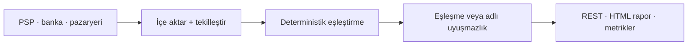

# atilgandev — Ödeme ve Veri Bütünlüğü Sistemleri için Backend Mühendisi

**Go · PostgreSQL · mutabakat · yüksek bütünlüklü yazılım**

Ürün şirketleri ve yazılım ajansları için para ve kayıtların doğru, açıklanabilir ve izlenebilir
kalması gereken backend sistemleri geliştiriyorum.

> **Ürün şirketleri ve yazılım ajanslarıyla sabit kapsamlı B2B çalışmalara açığım.**
>
> Problemi, mevcut teknoloji yığınını, beklenen teslimatı ve zaman planını
> [e-postayla gönderin](mailto:hilberspace@gmail.com).

Şartname, ticket, dokümantasyon ve kod incelemesi için profesyonel yazılı İngilizceyle async-first
çalışırım.

📍 Türkiye · [GitHub profili](https://github.com/hilberspace-dev) ·
[Ayrıntılı İngilizce portföy](README.md)

## Hizmetler

- **Ödeme mutabakatı ve finansal veri sistemleri** — PSP, banka ve pazaryeri entegrasyonları,
  deterministik eşleştirme, uyuşmazlık sınıflandırma ve raporlama.
- **Go/PostgreSQL backend güvenilirliği** — şema değişmezleri, idempotency, API'ler, otomatik
  testler, CI ve gözlemlenebilirlik.
- **Yazılım ajansları için kapsamı belli backend alt yükleniciliği** — tanımlı ticket veya
  şartnamenin test, kanıt, dokümantasyon ve devir paketiyle bağımsız teslimi.

Kanıta dayalı teslimat: tekrarlanabilir testler, açık değişmezler, uygun işlerde negatif kontroller
ve belgelenmiş sonuçlar.

---

## Öne çıkan proje — ReconPilot

### Deterministik ödeme mutabakat motoru

[Vaka çalışması](projects/03-reconpilot-payment-reconciliation/README.tr.md) ·
[**🇬🇧 English**](projects/03-reconpilot-payment-reconciliation/) ·
[Açık kaynak, testler ve benchmark](https://github.com/hilberspace-dev/reconpilot) ·

**Problem.** PSP raporları, banka ekstreleri ve pazaryeri hakedişleri aynı parayı farklı biçimlerde
anlatır. Elle mutabakat, tesadüfi yanlış eşleşmeler ve kalan kayıtlardan sessizce düşen işlemler
üretebilir.

**Teslim edilen çözüm.** Üç kaynağı içeri alıp tekilleştiren; deterministik kesin → toleranslı → grup
eşleştirme zinciri uygulayan; eşleşmeyen her kaydı sınıflandıran ve doğruluk değişmezleri ihlal
edildiğinde sonuç üretmeyen Go/PostgreSQL servisi.

**Ticari karşılık.** Tohumlu sentetik benchmark ~50 bin işlemi ~4 saniyede uzlaştırıyor:
**7/7 enjekte edilmiş uyuşmazlık tipi tespit, 0 yanlış eşleşme ve 0 kaçırılmış amaçlanan
eşleşme/grup**. Doğrulanan bu kapsamda hiçbir kayıt sonuçtan sessizce kaybolmuyor; manuel inceleme,
izsiz bir kalandan değil açık bir uyuşmazlık sınıfından başlıyor.

*Altın veri seti HTML raporu — tam boyut için görsele tıklayın.*

**Teslim edilen kapsam**

- Sürümlü REST, sunucu taraflı HTML, health/readiness ve Prometheus metrikleri sunan Go servisi
- Tekilleştirme ve eşleşme bütünlüğü kısıtları içeren PostgreSQL şeması ve migration'lar
- Entegrasyon ve property-based testler, Docker Compose, CI, ADR'ler ve operasyon dokümantasyonu

**Benzer teslimatlar:** PSP/banka/pazaryeri entegrasyonları · mutabakat motorları · işlem
tekilleştirme · finansal raporlama backend'leri · veri bütünlüğü denetimleri

---

## Ticari çalışma

### Aura — Fotogerçekçi 3D Cerrahi Önizleme ve Klinik Platformu *(özel, ticari)*

[Vaka çalışması](projects/04-aura-photoreal-3d-clinic-platform/README.tr.md) ·
[**🇬🇧 English**](projects/04-aura-photoreal-3d-clinic-platform/)

**Problem.** Hastaya özel görsel simülasyonu ve günlük klinik operasyonlarını, hasta bağlantılı veri
işlemeyi zayıflatmadan tek bir ticari ürüne dönüştürmek.

**Teslim edilen çözüm.** Ürün, web uygulaması, API ve GPU/ML iş yüklerinde tek başına teknik
sahiplik; hastaya özel önizleme deneyimi ve onu çevreleyen klinik iş akışı.

**Ticari karşılık.** Gizlilik kontrolleri ve operasyonel devir paketi bulunan, kliniğe hazır ticari
ürün. Kaynak kod ile uygulamaya özgü müşteri fikrî mülkiyeti gizlidir; vaka çalışması yalnızca
sorumlulukları ve hassas olmayan kanıtları belgeler.

**Teslim edilen kapsam**

- Full-stack ürün, API ve GPU/ML iş yükü entegrasyonu
- Çıktı tutarlılığı, ödeme, gizlilik ve erişilebilirlik için otomatik kontroller
- Sürüm betikleri, runbook'lar, uyum dokümanları ve kaynak kod devir paketi

---

## Güvenlik araştırmaları

### ERC-4337 EntryPoint v0.8 — Güvenlik İncelemesi

[Vaka çalışması](projects/02-erc4337-entrypoint-review/README.tr.md) ·
[**🇬🇧 English**](projects/02-erc4337-entrypoint-review/)

**Problem.** Yoğun biçimde denetlenmiş bir hesap soyutlama bileşenini kendi belgelenmiş doğruluk
kurallarına karşı sınamak.

**Teslim.** Bağımsız kaynak kod incelemesi, negatif kontrollü kanıt ve digest ile sabitlenmiş Prague
istemcisinde ikinci tekrar üretim.

**Sonuç.** Düşük şiddetli deterministik bir doğruluk kusuru iki ortamda tekrar üretildi. Bulgu
gönderilmedi veya dışarıdan doğrulanmadı; upstream'de düzeltilmediği için mekanizma açıklanmıyor.

### Canlı Protokol Denetimi (~16,7M $) — Disiplinli NO-GO

[Vaka çalışması](projects/01-smart-contract-security-audit/README.tr.md) ·
[**🇬🇧 English**](projects/01-smart-contract-security-audit/)

**Problem.** Canlı bir protokoldeki şüphenin sorumlu bir bildirim gerektirip gerektirmediğini
belirlemek.

**Teslim.** ~45 milyon blok üzerinde zincir analizi, deployed bytecode doğrulaması, 14 değişmezli
şartname ve sabit blokta Foundry kanıtı.

**Sonuç.** En güçlü hipotez tekrar üretildi, sonra kendi kanıtıyla çürütüldü. Bulgu gönderilmedi;
abartılı iddia yerine çalışmayı durdurup eforu başka hedefe yönlendirme kararı verildi.

---

## Mühendislik süreci

1. Kapsam ve kabul kriterleri
2. Yazılı teknik plan
3. Artımlı uygulama
4. Testler ve tekrarlanabilir doğrulama
5. Dokümantasyon ve devir

Kapsamı belli ticket veya şartnameyi alır, bağımsız çalışır ve incelenebilir sonucu testleriyle
birlikte teslim ederim. Saldırgan bakış açılı güvenlik incelemesi ve kanıt paketleme standardı için
[Güvenlik İncelemesi ve PoC Metodolojisi](METHODOLOGY.tr.md) belgesine bakın.

## Teknik beceriler

**Ana alanlar:** Go · PostgreSQL · backend mimarisi · ödeme ve işlem sistemleri · API
entegrasyonları · test ve CI · Docker · gözlemlenebilirlik

**Ek deneyim:** TypeScript / Node.js · .NET · React · bilgisayarlı görü ve GPU iş yükleri ·
Solidity / EVM

## İletişim

Ürün şirketi veya yazılım ajansından sabit kapsamlı B2B iş talepleri için
[e-postada](mailto:hilberspace@gmail.com) şunları paylaşın:

- çözülmesi gereken problem
- mevcut teknoloji yığını
- beklenen teslimat
- hedef zaman planı
- repo veya erişim kısıtları

Şartname, ticket, dokümantasyon ve kod incelemesi için profesyonel yazılı İngilizceyle async-first
çalışırım.

---

*Bu, işler tamamlandıktan sonra yayımlanmış derlenmiş bir portföydür. Commit tarihleri yayımlama
ve dokümantasyon geçmişini yansıtır, orijinal geliştirme takvimini değil.*
