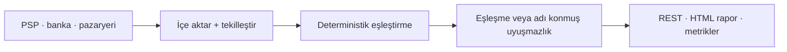

# Para ve kayıt doğruluğunun kritik olduğu backend sistemleri

**Mutabakat · ödeme ve banka entegrasyonları · KVKK uyumlu veri işleme · devralınan sistemlerin
toparlanması**

Ödemenin, faturanın ve kaydın birbirini tutması gereken yerlerde backend geliştiriyorum. Çalıştığım
işlerin ortak paydası şudur: bir yerde para ya da kayıt kaybolur, kimse tam olarak nerede
kaybolduğunu gösteremez ve elle kapatılan her ay hem maliyet hem risk üretir.

### Taklit edilmesi zor üç şey

- **Bir ürünün tamamını tek başıma taşıdım.** Ödeme alan, kişisel veri işleyen ve GPU/ML workload'u
  çalıştıran, canlı ve multi-tenant bir ticari SaaS'ın tek teknik sahibiydim. Mimari, API, web
  arayüzü, release süreci, KVKK dokümantasyonu ve handover paketi bana aitti.
- **Başkalarının incelemiş olduğu para kodunda hata bulurum.** İşlemleri doğrulayan ve ödemesini
  yapan, yoğun biçimde denetlenmiş bir bileşen olan ERC-4337 EntryPoint v0.8'de deterministik bir
  doğruluk kusurunu iki ayrı ortamda tekrar ürettim; birincisini negatif kontrollü bir kanıtla,
  ikincisini digest ile sabitlenmiş bağımsız bir ortamda doğruladım. Bir mutabakat defterine ya da
  bir ödeme callback'ine de aynı yöntemle bakarım.
- **Kanıt "dur" diyorsa dururum.** Yaklaşık 16,7 milyon dolarlık bir incelemede kendi kanıtım en
  güçlü hipotezimi çürüttüğü için çalışmayı yazılı bir NO-GO ile bitirdim; hiçbir bildirim
  göndermedim. Sayılar umduğunuz sonucu desteklemiyorsa bunu ilk benden duyarsınız.

Asıl önemli olan üçüncüsüdür. Bu portföydeki her iddia doğrulanabilir; doğrulanamayacak olanlar ise
açıkça öyle işaretlenmiştir.

> ### Sabit kapsamlı iş alıyorum
>
> Problemi, mevcut sistemi ve beklediğiniz sonucu yazın; kapsamı, süreyi ve teslim edilecekleri
> yazılı olarak geri göndereyim. İlk görüşme ve ön değerlendirme ücretsizdir.
>
> **[E-posta →](mailto:hilberspace@gmail.com)** · **[WhatsApp →](https://wa.me/905431064025)** ·
> **[+90 543 106 40 25](tel:+905431064025)**

**atilgandev** · 📍 Türkiye · Türkçe yürütülen projeler, Türkçe dokümantasyon ·
[GitHub profili](https://github.com/hilberspace-dev) ·
[English portfolio](README.md)

---

## Hangi problemleri çözüyorum

**"PSP raporu, banka ekstresi ve pazaryeri hakedişi birbirini tutmuyor."**
Üç kaynak aynı parayı farklı biçimde anlatır. Elle yapılan mutabakat iki sessiz risk taşır:
tesadüfen eşleşen yanlış kayıtlar ve kalan listesinden düşerek kaybolan işlemler. Bu işi üç ilke
üzerine kurulu sistemlerle çözüyorum: eşleştirme deterministiktir, eşleşmeyen her kayıt adı konmuş
bir sınıfa düşer ve bir doğruluk kuralı ihlal edildiğinde sistem sonuç üretmek yerine durur.

**"Sistemi yazan ekip gitti, kimse dokunmaya cesaret edemiyor."**
Testi olmayan, dokümante edilmemiş ve her değişiklikte başka bir yeri kıran sistemlerden söz
ediyoruz. Böyle bir işte önce davranışı sabitlerim: mevcut davranışı kayıt altına alan testler ve
açıkça yazılmış invariant'lar. Kontrollü değişiklik ancak ondan sonra başlar. Devrederken yalnızca
çalışan bir sistem değil, **devralınabilir** bir sistem bırakırım.

**"KVKK ve denetim tarafında kanıt üretemiyoruz."**
Kişisel veriye dokunan ürünlerde saklama, rıza, silme ve erişim kontrollerinin yalnızca yazılı
olması yetmez; **çalıştırılabilir** olması gerekir. Uyum kontrollerini otomatik çalıştıran ve kendi
kanıtını üreten sistemler kurdum. Denetim sırasında bir komut çalıştırmakla haftalarca ekran
görüntüsü toplamak arasındaki fark budur.

| | KOBİ ve büyüyen ürün şirketleri | Kurumsal ve holding yapıları |
| --- | --- | --- |
| **Tipik ihtiyaç** | Tek bir kritik problemin hızlı ve kalıcı çözümü; iç ekibi büyütmeden ilerlemek | Mevcut sisteme dokunan, denetlenebilir ve devredilebilir bir iş paketi |
| **Çalışma biçimi** | Sabit kapsam, sabit fiyat, tek muhatap | Tanımlı iş paketi, yazılı kabul kriterleri, NDA, süreç dokümanı |
| **Teslimde alınan** | Çalışan sistem + testler + nasıl işletileceği | Yukarıdakiler + ADR'ler, runbook, handover paketi, denetim kanıtı |

> ### Ücretsiz teşhis
>
> Anonimleştirilmiş bir mutabakat ekstresi ya da örnek veri gönderin; sessiz kayıpların nerede
> oluştuğunu ve bunların nasıl kapatılacağını yazılı olarak geri göndereyim. Karşılığında herhangi
> bir taahhüt beklemiyorum. Ne yapabildiğimi anlatmak yerine kendi verinizin üzerinde göstermenin en
> kısa yolu budur.

---

## Nasıl çalıştığım — yazılı olarak

Bu depoda iki metodoloji belgesi bulunuyor. Bunlar pazarlama metni değil, fiilen kendime
uyguladığım standartlardır; aradığınız kişi olup olmadığıma karar vermenizin de en hızlı yoludur.

- **[Teslim ve Quality Gate Metodolojisi](DELIVERY-METHODOLOGY.tr.md)** — bir değişikliğin
  production'a nasıl çıktığı: gate merdiveni, eski debt'in nasıl dondurulup aşağı zorlandığı,
  çalıştıran değil yakalayan testler, contract disiplini, release verification ve rollback.
- **[Güvenlik İncelemesi ve PoC Metodolojisi](METHODOLOGY.tr.md)** — bir defect'in nasıl
  kanıtlandığı: invariant şartnamesi, çok açılı saldırgan inceleme, bir bulgunun sağlaması gereken
  beş halkalı zincir ve değerlendirmeye hazır paketleme.

İkisinin de dayandığı ilke aynı: **iddiadan önce kanıt.** Çalıştırılan komut, çıktısı ve exit code'u
olmadan hiçbir şeye "düzeldi", "geçiyor" veya "bitti" denmez — çalıştırılmayan ne varsa açıkça
söylenir.

Ayrıca mutabakat motorunun kaynak kodu, testleri ve benchmark'ı herkese açıktır; iddia ettiğim
sayıyı kendiniz çalıştırarak doğrulayabilirsiniz.

---

## Referans işler

### 1. Aura — Fotogerçekçi 3D Cerrahi Önizleme ve Klinik Platformu *(özel, ticari)*

[Vaka çalışması](projects/04-aura-photoreal-3d-clinic-platform/README.tr.md) ·
[English](projects/04-aura-photoreal-3d-clinic-platform/)

**Durum.** Hastaya özel görsel simülasyonu ve günlük klinik operasyonunu, hasta verisinin
işlenmesinden ödün vermeden tek bir ticari üründe birleştirmek gerekiyordu.

**Yaptığım.** Bu benim kendi ticari ürünüm; tamamını tek başıma yazdım. Ürün, web uygulaması, API ve
GPU/ML workload'larının teknik sahibi bendim. Multi-tenant mimari, ödeme akışı, KVKK kontrolleri,
otomatik quality gate'ler ile release ve deployment süreci bu kapsamdaydı.

**Sonuç.** Gizlilik kontrolleri ve operasyonel devir paketiyle birlikte kliniğe hazır hâle gelmiş
bir ticari ürün. Fikrî mülkiyet devir için hazırlandığından kaynak kod kapalı tutuluyor; vaka
çalışması yalnızca üstlendiğim sorumlulukları ve hassas olmayan kanıtları belgeliyor.

`TypeScript` `React` `Node.js` `multi-tenant SaaS` `ödeme` `KVKK` `GPU/ML` `otomatik test`

### 2. ReconPilot — Deterministik ödeme mutabakat motoru

[Vaka çalışması](projects/03-reconpilot-payment-reconciliation/README.tr.md) ·
[English](projects/03-reconpilot-payment-reconciliation/) ·
[Açık kaynak, testler ve benchmark](https://github.com/hilberspace-dev/reconpilot) ·

**Durum.** PSP raporları, banka ekstreleri ve pazaryeri hakedişleri aynı parayı farklı biçimlerde
anlatır; elle mutabakat yanlış eşleşme ve sessiz kayıp üretir.

**Yaptığım.** Üç kaynağı içeri alıp tekilleştiren, kesin → toleranslı → grup eşleştirme zincirini
deterministik biçimde uygulayan, eşleşmeyen her kaydı sınıflandıran ve correctness invariant'ları
ihlal edildiğinde sessizce devam etmek yerine duran Go/PostgreSQL servisi.

**Sonuç.** Seed'li sentetik benchmark yaklaşık 50 bin işlemin mutabakatını yaklaşık 4 saniyede
tamamlıyor: **enjekte edilmiş 7 uyuşmazlık tipinin 7'si de tespit edildi, 0 yanlış eşleşme, 0
kaçırılmış eşleşme.** Bu kapsamda hiçbir kayıt sonuçtan sessizce kaybolmuyor; manuel inceleme, izi
sürülemeyen bir bakiye kalanından değil, adı konmuş bir uyuşmazlık sınıfından başlıyor. *(Rakamlar
üretim verisinden değil, herkese açık sentetik veri setinden gelir; kendiniz de çalıştırabilirsiniz.)*

*Altın veri seti HTML raporu — tam boyut için görsele tıklayın.*

`Go` `PostgreSQL` `REST` `Prometheus` `Docker Compose` `property-based test` `CI`

### 3. Bağımsız güvenlik incelemeleri

Para ve varlık taşıyan kodu, kendi belgelenmiş kurallarına karşı bağımsız olarak incelediğim iki
çalışma. İkisi de aynı disipline dayanıyor: kanıtlanamayan bulgu raporlanmaz.

**ERC-4337 EntryPoint v0.8 incelemesi** — yoğun denetlenmiş bir bileşende düşük şiddetli
deterministik bir doğruluk kusuru, negatif kontrollü kanıtla ve digest ile sabitlenmiş ikinci bir
ortamda olmak üzere iki kez tekrar üretildi.
[Vaka çalışması](projects/02-erc4337-entrypoint-review/README.tr.md)

**Canlı protokol denetimi (~16,7M $) — disiplinli NO-GO** — en güçlü hipotez önce tekrar üretildi,
sonra kendi kanıtıyla çürütüldü. Bulgu gönderilmedi; abartılı iddia yerine durma kararı verildi.
[Vaka çalışması](projects/01-smart-contract-security-audit/README.tr.md)

---

## Nasıl çalışıyoruz

**Riski küçük tutarak başlıyoruz.** Bir referans listesi okuyup bana güvenmenizi beklemiyorum. Bunun
yerine ilk adımı ucuz ve geri dönülebilir yapıyorum:

- **Ücretli ön analiz.** Birkaç günlük, sabit ücretli, kendi başına duran bir iş. Çıktısı yazılı bir
  teşhis raporu: problem nerede, kök neden ne, hangi seçenekler var ve her birinin tahmini eforu.
  Devam etmemeye karar verseniz de rapor sizde kalır.
- **Milestone bazlı ödeme.** Peşin toplu ödeme yok; her teslim parçası kendi ödemesini taşır.
- **İlk milestone'da yazılı kabul kriteri.** Kriteri karşılamazsam o milestone'u faturalamam. Bunu
  yazmamın sebebi, maliyetinin bana ait olmasıdır; referansın yerini tutan da budur.

Sonrasındaki akış:

1. **Ön görüşme (ücretsiz).** Problemi, mevcut sistemi ve beklenen sonucu birlikte konuşuruz. İş
   sizin için doğru iş değilse bunu ilk görüşmede söylerim.
2. **Yazılı kapsam.** Ne yapılacağı, ne yapılmayacağı, kabul kriterleri, süre ve sabit fiyat yazılı
   olarak belirlenir. Kapsam dışı işleri sonradan sürpriz olarak önünüze getirmem.
3. **Artımlı teslim.** Sonuç parça parça çalışır hâlde teslim edilir; her adımda hangi komutun
   çalıştırıldığı ve ne döndürdüğü yazılı olarak paylaşılır.
4. **Doğrulama.** Testler, tekrar üretilebilir kontroller ve uygun işlerde kendi iddiamı çürütmeyi
   amaçlayan negatif kontroller uygulanır.
5. **Devir.** Dokümantasyon, runbook ve gerektiğinde ekibinize devir oturumu sağlanır. Arkamda size
   bağımlılık yaratan bir sistem bırakmam.

**Gizlilik.** Müşteri işlerinde NDA ile çalışırım; müşteri kaynak kodu ve verisi hiçbir portföy
belgesinde yer almaz. Bu depodaki ticari vaka çalışması ise kendi ürünüm; fikrî mülkiyet devre
hazırlandığı için ayrıntıları kapalı tutuluyor.

---

## Teknik kapsam

**Ana alanlar:** Go · PostgreSQL · Node.js / TypeScript · backend mimarisi · ödeme ve işlem
sistemleri · mutabakat · API entegrasyonları · otomatik test ve CI · Docker · observability

**Ek deneyim:** React · .NET · bilgisayarlı görü ve GPU iş yükleri · Solidity / EVM

**Çalışma dili.** Projeler Türkçe yürütülür. Şartname, dokümantasyon ve kod incelemesi Türkçe veya
İngilizce olarak, ekibinizin tercihine göre hazırlanır.

---

## İletişim

**Telefon / WhatsApp:** [+90 543 106 40 25](tel:+905431064025) ·
**E-posta:** [hilberspace@gmail.com](mailto:hilberspace@gmail.com)

Şunları paylaşırsanız ilk dönüşte kapsam ve süre tahmini verebilirim:

- çözülmesi gereken problem ve bugün nasıl idare edildiği
- mevcut sistem ve teknoloji yığını
- beklenen teslimat
- hedef zaman planı
- erişim kısıtları (repo, ortam, NDA)

---

*Bu portföy, işler tamamlandıktan sonra derlenip yayımlanmıştır. Commit tarihleri yayımlama ve
dokümantasyon geçmişini yansıtır, orijinal geliştirme takvimini değil.*
