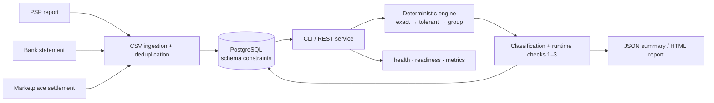

# Case Study — ReconPilot: Deterministic Payment Reconciliation Engine

> ### Claim: 50K transactions · 3 sources · 7 injected discrepancy types → 7/7 detected, 0 false matches, 0 intended pairs/groups missed
>
> | | |
> |---|---|
> | **Repository** | [Public source, tests and benchmark](https://github.com/hilberspace-dev/reconpilot) |
> | **Benchmark** | Seeded and deterministic — `go run ./cmd/benchmark` reproduces the dataset and checks on any machine |
> | **"0 false matches"** | Every produced match is validated member-by-member against generator ground truth; the benchmark reports 0 false matches |
> | **CI** | Every push runs PostgreSQL integration tests, architecture/vulnerability checks, a seeded Compose endpoint smoke test and the benchmark |
> | **Service surface** | Versioned REST endpoint, HTML report, health/readiness, Prometheus metrics and one-command seeded Docker Compose stack |
> | **Stack** | Go 1.26 + PostgreSQL — one module, one static binary, stdlib-first (only runtime dependency: `pgx`) |
>
> The benchmark uses synthetic data with deliberately injected discrepancies; the generator is in the
> repository. It evaluates deterministic engine behaviour, not production mileage on customer data.

> **In plain terms (for non-technical readers).** An online store gets paid through several channels
> at once — the card-payment provider, marketplaces, and its bank account — and each one reports the
> "same" money differently. Someone in finance has to make the three stories agree, usually by hand
> in Excel, where mistakes are silent and expensive. I built software that does this automatically
> for tens of thousands of transactions in seconds and sorts every mismatch into a named category.
> One command replays a 50,000-transaction benchmark in which every decision is checked against a
> known answer key, with zero wrong pairings. It refuses to return a result if an input record is
> neither matched nor classified, or if a transaction-level discrepancy delta violates its type's
> money rules.

**Role:** Design and implementation (solo)
**Domain:** E-commerce payment operations — PSP reports vs. bank statements vs. marketplace settlements
**Outcome:** A reconciliation service whose correctness rules are enforced by runtime and database
invariants, exercised by property-based tests, exposed through REST/HTML/metrics, and reproducible
through a seeded benchmark and Docker Compose demo.

---

## The problem

A mid-size e-commerce operation collects money through several pipes at once: card payments through a
PSP, marketplace settlements paid out days later as lump sums (gross minus commission, dozens of
orders per payout), and a bank statement recording whatever actually moved. Finance teams close the
gap by hand in Excel, and manual matching has two silent failure modes: **false matches** (amounts
that coincide get glued together — the books look closed but are wrong) and **lost residue** (records
that fall out of every filter and are quietly written off). Neither leaves a trace.

## System view



## The engineering

- **Three-stage matching chain**, deterministic and explainable: exact (reference + amount +
  direction, ±3-day window) → tolerant (±0.5%, bank lines only) → bounded many-to-one group matching
  for payouts (payout = Σ orders − commission). The subset search is bounded *before* it starts —
  counterparty + 14-day window, ≤20 candidates — and overflow degrades to an explicit `unknown` instead
  of guessing.
- **Three runtime invariants, hard-failing:** every input transaction is matched or classified; no
  transaction appears in two match groups; and every transaction-level discrepancy delta obeys its
  type's money semantics. A fourth, ingestion-level guarantee makes re-ingesting the same file a
  no-op through PostgreSQL `UNIQUE(dedup_key)` and a real-database integration test. The schema also
  backs the no-double-match rule and rejects ownerless discrepancy rows.
- **Money is `int64` minor units end-to-end.** No floats, no epsilons — one-kuruş differences remain
  exactly representable throughout matching, classification and reporting.
- **Architecture as a build failure, not an opinion:** the one-way flow
  `ingestion → matching → classification → reporting` is enforced by `go-arch-lint` in CI.

## Operational surface

`POST /api/v1/reconciliation-runs` loads stored transactions, invokes the same pure engine as the
CLI, checks the three runtime invariants and atomically persists the result. `/healthz` separates process
liveness from PostgreSQL-aware `/readyz`; `/metrics` exposes fixed-cardinality Prometheus metrics;
`/report` serves the existing HTML report. The server has bounded timeouts and graceful shutdown.

`docker compose up --build -d` builds a non-root static image, starts PostgreSQL, idempotently loads
the golden dataset and waits for API readiness. This closes the gap between a benchmarked algorithm
and an operable service without introducing a second stack.

## Verification

Property-based tests (100 randomized books per run, with shrinking) exercise the invariants;
integration tests run against real PostgreSQL via testcontainers, not a mock. The benchmark generates
~50K transactions with seven discrepancy types injected at known positions and validates every
produced match against the generator's intended pairing:

```
type           injected   detected
commission          193       2036  ok
refund              386        386  ok
partial             193        386  ok
timing              193        386  ok
duplicate           193        193  ok
missing             193        193  ok
unknown             193        193  ok

false matches: 0 — intended pairs/groups not fully matched: 0
runtime invariants: 3/3 PASSED (checked inside engine.Run)
RESULT: PASS — 7/7 injected types detected, 0 false matches, 0 intended pairs/groups missed
```

It exits non-zero on any false match, missed pairing or undetected type; CI runs it on every push.

Every load-bearing decision has an ADR in the repository: integer money, single-stack rationale,
the bounded group search, schema-level invariants, and the HTTP/observability boundary.

`Go` `PostgreSQL` `REST` `Prometheus` `Docker Compose` `pgx` `property-based testing`
`testcontainers` `CI` `invariant-driven design`
