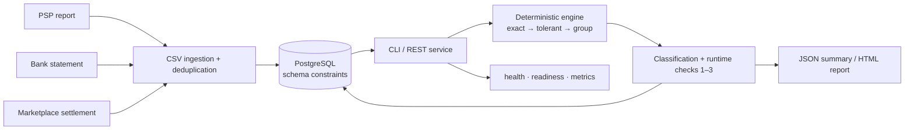

[](README.tr.md)

# Case study: ReconPilot, a deterministic payment reconciliation engine

> ### Claim: about 49,000 transactions (`-n 50000`) · 3 sources · 7 injected discrepancy types → 7/7 detected, 0 false matches, 0 intended pairs/groups missed
>
> | | |
> |---|---|
> | Repository | [Public source, tests and benchmark](https://github.com/hilberspace-dev/reconpilot) |
> | Benchmark | Seeded and deterministic: `go run ./cmd/benchmark` reproduces the dataset and checks on any machine |
> | "0 false matches" | Every produced match is validated member-by-member against generator ground truth; the benchmark reports 0 false matches |
> | CI | Every push runs PostgreSQL integration tests, architecture/vulnerability checks, a seeded Compose endpoint smoke test and the benchmark |
> | Service surface | Versioned REST endpoint, HTML report, health/readiness, Prometheus metrics and one-command seeded Docker Compose stack |
> | Stack | Go 1.26 + PostgreSQL; one module; the service is one static binary (`recon`), and a second small binary (`verify`) serves the benchmark panel; stdlib-first (only runtime dependency: `pgx`) |
>
> The benchmark uses synthetic data with injected discrepancies, and the generator is in the
> repository. It tests deterministic engine behaviour and has never run on customer data. Keeping
> the ground truth unambiguous is a design choice of the synthetic data: the open rows of an injected
> discrepancy never share a tolerant window with an open row of another injected order of the same
> seller (clean orders are matched exactly first), and a seller paid in groups gets at most two
> payouts. The second group is shifted 35 days later, so the two 14-day
> payout windows never overlap (the gap between the two payout dates is 16 to 54 days). Real books
> can contain ambiguous same-seller rows that the tolerant or group matcher would pair.

> For non-technical readers: an online store gets paid through several channels at once (the
> card-payment provider, marketplaces and its bank account), and each one reports the "same" money
> differently. Someone in finance has to make the three stories agree, usually by hand in Excel, where
> mistakes are silent and expensive. ReconPilot does this automatically for tens of thousands of
> transactions in seconds and sorts every mismatch into a named category. One command replays a
> benchmark of about 49,000 transactions in which every decision is checked against a known answer
> key, with zero wrong pairings. It refuses to return a result if an input record is neither matched
> nor classified, or if a transaction-level discrepancy delta violates its type's money rules.

- Domain: e-commerce payment operations; PSP reports vs. bank statements vs. marketplace settlements
- Outcome: a reconciliation service whose correctness rules are enforced by runtime and database
  invariants and exercised by property-based tests. It is exposed through REST, HTML and metrics, and
  a seeded benchmark and a Docker Compose demo reproduce it.

## The problem

A mid-size e-commerce operation collects money through several pipes at once: card payments through a
PSP, marketplace settlements paid out days later as lump sums (gross minus commission, dozens of
orders per payout), and a bank statement recording whatever actually moved. Finance teams close the
gap by hand in Excel, and manual matching fails silently in two ways. A false match glues together
records whose amounts happen to coincide, so the books look closed but are wrong. Lost residue is the
records that fall out of every filter and get written off without anyone noticing. Neither leaves a
trace.

## System view


```mermaid
flowchart LR
    P["PSP report"] --> I["CSV ingestion + deduplication"]
    B["Bank statement"] --> I
    M["Marketplace settlement"] --> I
    I --> DB[("PostgreSQL<br/>schema constraints")]
    DB --> S["CLI / REST service"]
    S --> E["Deterministic engine<br/>exact → tolerant → group"]
    E --> V["Classification + runtime checks 1–3"]
    V --> DB
    V --> O["JSON summary / HTML report"]
    S --> X["health · readiness · metrics"]
```

## The engineering

- Matching runs as a deterministic, explainable chain of three stages: exact (reference + amount +
  direction, ±3-day window), then tolerant (±0.5%, bank lines only), then bounded many-to-one group
  matching for payouts (payout = Σ orders − commission). The subset search is bounded before it
  starts (counterparty + 14-day window, ≤20 candidates), and overflow degrades to an explicit
  `unknown` instead of a guess.
- Three runtime invariants fail hard: every input transaction is matched or classified; no
  transaction appears in two match groups; and every transaction-level discrepancy delta obeys its
  type's money semantics. A fourth guarantee, at ingestion level, means re-ingesting the same file
  adds no transactions, through PostgreSQL `UNIQUE(dedup_key)`, and a real-database integration
  test covers it. The schema also backs the no-double-match rule and rejects ownerless discrepancy
  rows.
- Money is `int64` minor units end-to-end. There are no floats and no epsilons, so one-kuruş
  differences stay exactly representable through matching, classification and reporting.
- The one-way flow `ingestion → matching → classification → reporting` is enforced by
  `go-arch-lint` in CI, so breaking the architecture fails the build.

## Operational surface

`POST /api/v1/reconciliation-runs` loads stored transactions, invokes the same pure engine as the
CLI, checks the three runtime invariants and atomically persists the result. `/healthz` reports
process liveness, and `/readyz` reports readiness with PostgreSQL taken into account. `/metrics`
exposes fixed-cardinality Prometheus metrics; `/report` serves the existing HTML report. The server
has bounded timeouts and graceful shutdown.

`docker compose up --build -d` builds the non-root static image, starts PostgreSQL, loads the golden
dataset (loading it again adds no transactions) and runs the first reconciliation; the API reports
readiness on `/readyz`. That turns the benchmarked algorithm into an operable service without a
second stack.

## Verification

Property-based tests (100 randomized books per run, with shrinking) exercise the invariants.
Integration tests run against real PostgreSQL via testcontainers, with no mock in between. The
benchmark generates about 49,000 transactions (`-n 50000`) with seven discrepancy types injected at
known positions. It checks that each injected record got its type, that the engine produced no
record the book does not account for, and every produced match against the generator's intended
pairing:

```
reconpilot benchmark: n=49003 seed=1
elapsed: 906.7748ms

type           injected   detected    emitted   expected
commission          193        193       2036       2036  ok
refund              386        386        386        386  ok
partial             193        193        386        386  ok
timing              193        193        386        386  ok
duplicate           193        193        193        193  ok
missing             193        193        193        193  ok
unknown             193        193        193        193  ok
(detected: injected records that got their type. expected: the injected records, a delta-0
 record for each commission, partial and timing counterpart, and 1650 group fee records)

clean books: pairs=17706 groups=1650, matches produced: 20128
false matches: 0, intended pairs/groups not fully matched: 0
runtime invariants: 3/3 PASSED (checked inside engine.Run)

RESULT: PASS, 7/7 injected types detected, 0 false matches, 0 intended pairs/groups missed
```

It exits non-zero on any false match, any intended pair or group not matched whole, any injected
record that got another type and any unaccounted record; CI runs it on every push.
The run passes for every seed from 1 to 100, at the default size (`-n 50000`) and at `-n 20000`, and a
shell loop over `-seed` checks it.

Each of the main design decisions has an ADR in the repository: integer money, single-stack
rationale, the bounded group search, schema-level invariants, and the HTTP/observability boundary.

`Go` `PostgreSQL` `REST` `Prometheus` `Docker Compose` `pgx` `property-based testing`
`testcontainers` `CI` `invariant-driven design`
