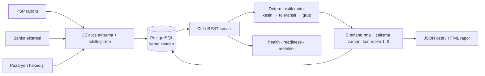

[](README.md)

# Vaka Çalışması — ReconPilot: Deterministik Ödeme Mutabakat Motoru

> ### İddia: 50 bin işlem · 3 kaynak · enjekte edilmiş 7 uyuşmazlık tipi → 7/7 tespit, 0 yanlış eşleşme, amaçlanan eşleşme/gruplarda 0 kayıp
>
> | | |
> |---|---|
> | **Repo** | [Açık kaynak kod, testler ve benchmark](https://github.com/hilberspace-dev/reconpilot) |
> | **Benchmark** | Sabit seed ile deterministik — `go run ./cmd/benchmark` veri setini yeniden üretir ve her makinede aynı kontrolleri çalıştırır |
> | **“0 yanlış eşleşme”** | Üretilen her eşleşmenin üyeleri, veri üretecinin bilinen doğru eşleme kümesiyle tek tek karşılaştırılır; benchmark 0 yanlış eşleşme raporlar |
> | **CI** | Her push'ta PostgreSQL entegrasyon testleri, mimari ve zafiyet kontrolleri, sabit seed'li Compose API smoke testi ve benchmark çalışır |
> | **Servis yüzeyi** | Sürümlü REST uç noktası, HTML rapor, health/readiness, Prometheus metrikleri ve tek komutla seed'li Docker Compose ortamı |
> | **Teknoloji** | Go 1.26 + PostgreSQL — tek modül, tek statik binary, standart kütüphane öncelikli (çalışma zamanındaki tek bağımlılık: `pgx`) |
>
> Benchmark sentetik veri ve bilerek enjekte edilmiş uyuşmazlıklar kullanır; veri üreteci repoda
> bulunur. Ölçülen şey, motorun deterministik davranışıdır; gerçek müşteri verisindeki üretim geçmişi
> değildir.

> **Teknik olmayan kısa anlatım.** Bir e-ticaret işletmesi aynı anda kart ödeme kuruluşundan,
> pazaryerlerinden ve banka hesabından para alır. Üç kaynak, “aynı” parayı farklı biçimlerde raporlar.
> Finans ekibinden biri bu üç anlatımın mutabakatını çoğunlukla Excel'de elle yapar; hatalar sessiz ve pahalı
> olabilir. Geliştirdiğim yazılım, on binlerce işlemin mutabakatını saniyeler içinde otomatik olarak yapıyor ve
> her farkı adı belli bir kategoriye yerleştiriyor. Tek komut, 50 bin işlemlik benchmark'ı tekrar çalıştırıyor
> ve her kararı bilinen doğru cevaplarla karşılaştırıyor; yanlış eşleştirme üretmiyor. Bir girdi
> eşleşmemiş veya sınıflandırılmamışsa ya da uyuşmazlık tutarı kendi türünün para kuralını ihlal
> ediyorsa sistem sonuç döndürmeyi reddediyor.

**Rol:** Tasarım ve uygulama (tek başına)<br>
**Alan:** E-ticaret ödeme operasyonları — PSP raporları, banka ekstreleri ve pazaryeri hakedişleri<br>
**Sonuç:** Doğruluk kuralları hem çalışma zamanı kontrolleriyle hem de veritabanı değişmezleriyle
uygulanan; property-based testlerle sınanan; REST, HTML ve metrik yüzeyleri bulunan; seed'li benchmark
ve Docker Compose demosuyla tekrar üretilebilen bir mutabakat servisidir.

---

## Problem

Orta ölçekli bir e-ticaret işletmesinde para aynı anda birkaç kanaldan akar: PSP üzerinden kart
ödemeleri, günler sonra toplu olarak ödenen pazaryeri hakedişleri (brüt tutar eksi komisyon, tek
ödemede onlarca sipariş) ve fiilen neyin hesaba geçtiğini gösteren banka ekstresi. Finans ekipleri bu
farkı çoğunlukla Excel'de elle kapatır. Elle eşleştirmenin iki sessiz hata türü vardır:
**yanlış eşleşme** (tutarları tesadüfen aynı olan kayıtlar birbirine bağlanır; defter kapanmış görünür
ama yanlıştır) ve **listeden düşen kayıt** (hiçbir filtreye girmeyen kayıt sessizce kaybolur). İkisi de
iz bırakmadan gerçekleşebilir.

## Sistem görünümü



## Mühendislik

- **Üç aşamalı eşleştirme zinciri** deterministik ve açıklanabilir biçimde ilerler: kesin
  (referans + tutar + yön, ±3 günlük pencere) → toleranslı (±%0,5, yalnızca banka satırları) →
  hakedişler için sınırlı çoktan-bire grup eşleştirme (hakediş = Σ siparişler − komisyon). Alt küme
  araması başlamadan önce sınırlandırılır: karşı taraf + 14 günlük pencere, en fazla 20 aday.
  Sınırı aşan durumlarda tahmin yürütmek yerine açıkça `unknown` sonucu üretilir.
- **İhlalde işlemi durduran üç çalışma zamanı değişmezi** vardır: her girdi ya eşleşir ya
  sınıflandırılır; hiçbir işlem iki eşleşme grubunda yer alamaz; işlem düzeyindeki her uyuşmazlık
  farkı kendi türünün para semantiğine uyar. İçe aktarma düzeyindeki dördüncü garanti, aynı dosyanın
  yeniden yüklenmesini PostgreSQL `UNIQUE(dedup_key)` ve gerçek veritabanı entegrasyon testiyle
  etkisiz kılar. Şema ayrıca çift eşleşmeyi engeller ve hiçbir işleme bağlı olmayan uyuşmazlık
  satırlarını reddeder.
- **Para, uçtan uca en küçük para birimi cinsinden `int64` olarak tutulur.** Float veya epsilon kullanılmaz; bir
  kuruşluk fark bile eşleştirme, sınıflandırma ve raporlama boyunca tam değerini korur.
- **Mimari sınır bir görüş değil, build kuralıdır:** `ingestion → matching → classification →
  reporting` tek yönlü akışı CI içinde `go-arch-lint` ile zorunlu tutulur.

## Operasyonel yüzey

`POST /api/v1/reconciliation-runs`, kayıtlı işlemleri yükler; CLI ile aynı saf motoru çalıştırır; üç
çalışma zamanı değişmezini kontrol eder ve sonucu atomik olarak kaydeder. `/healthz` süreç
canlılığını, PostgreSQL durumunu da bilen `/readyz` ise hazır olma hâlini gösterir. `/metrics`, etiket
çeşitliliği sınırlandırılmış Prometheus metrikleri sunar; `/report` mevcut HTML raporunu yayınlar.
Sunucuda süre sınırları ve kontrollü kapanma bulunur.

`docker compose up --build -d`, root olmayan statik imajı oluşturur; PostgreSQL'i başlatır; golden
veri setini idempotent biçimde yükler ve API hazır olana kadar bekler. Böylece benchmark ile doğrulanmış
algoritma, ikinci bir teknoloji yığını eklenmeden çalıştırılabilir bir servise dönüşür.

## Doğrulama

Property-based testler, her çalışmada üretilen 100 rastgele işlem defteri üzerinde değişmezleri
sınar; hata bulunduğunda örnek en küçük hâline indirgenir (shrinking). Entegrasyon testleri mock yerine testcontainers ile gerçek PostgreSQL üzerinde
çalışır. Benchmark, bilinen konumlara yedi uyuşmazlık türü enjekte edilmiş yaklaşık 50 bin işlem
üretir ve bulunan her eşleşmeyi veri üretecinin amaçladığı eşleme kümesiyle karşılaştırır:

```text
type           injected   detected
commission          193       2036  ok
refund              386        386  ok
partial             193        386  ok
timing              193        386  ok
duplicate           193        193  ok
missing             193        193  ok
unknown             193        193  ok

false matches: 0 — intended pairs/groups not fully matched: 0
runtime invariants: 3/3 PASSED (checked inside engine.Run)
RESULT: PASS — 7/7 injected types detected, 0 false matches, 0 intended pairs/groups missed
```

Herhangi bir yanlış eşleşme, kaçırılmış eşleşme veya tespit edilemeyen tür varsa komut sıfırdan
farklı çıkış koduyla kapanır. CI bu benchmark'ı her push'ta yeniden çalıştırır.

Sistemin doğruluğunu belirleyen her karar için repoda bir ADR bulunur: tamsayı para modeli, tek stack
gerekçesi, sınırlı grup araması, şema düzeyindeki değişmezler ve HTTP/gözlemlenebilirlik sınırı.

`Go` `PostgreSQL` `REST` `Prometheus` `Docker Compose` `pgx` `property-based testing`
`testcontainers` `CI` `invariant-driven design`
