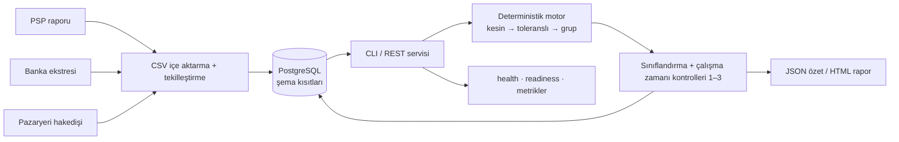

[](README.md)

# Vaka çalışması: ReconPilot, deterministik ödeme mutabakat motoru

> ### İddia: yaklaşık 49 bin işlem (`-n 50000`) · 3 kaynak · enjekte edilmiş 7 uyuşmazlık tipi → 7/7 tespit, 0 yanlış eşleşme, amaçlanan eşleşme/gruplarda 0 kayıp
>
> | | |
> |---|---|
> | Repo | [Açık kaynak kod, testler ve benchmark](https://github.com/hilberspace-dev/reconpilot) |
> | Benchmark | Sabit seed ile deterministik: `go run ./cmd/benchmark` veri setini yeniden üretir ve her makinede aynı kontrolleri çalıştırır |
> | "0 yanlış eşleşme" | Üretilen her eşleşmenin üyeleri, veri üretecinin bilinen doğru eşleme kümesiyle tek tek karşılaştırılır; benchmark 0 yanlış eşleşme raporlar |
> | CI | Her push'ta PostgreSQL entegrasyon testleri, mimari ve zafiyet kontrolleri, sabit seed'li Compose API smoke testi ve benchmark çalışır |
> | Servis yüzeyi | Sürümlü REST uç noktası, HTML rapor, health/readiness, Prometheus metrikleri ve tek komutla seed'li Docker Compose ortamı |
> | Teknoloji | Go 1.26 + PostgreSQL; tek modül; servis tek bir statik binary (`recon`), benchmark panelini ise ikinci küçük bir binary (`verify`) sunar; standart kütüphane öncelikli (çalışma zamanındaki tek bağımlılık: `pgx`) |
>
> Benchmark sentetik veri ve enjekte edilmiş uyuşmazlıklar kullanır; veri üreteci repoda bulunur.
> Benchmark motorun deterministik davranışını sınar; gerçek müşteri verisiyle hiç çalıştırılmadı.
> Doğru cevap kümesinin tek anlamlı olması sentetik verinin bir tasarım tercihidir: enjekte edilen
> bir uyuşmazlığın açık satırları, aynı satıcının enjekte edilmiş başka bir siparişinin açık
> satırlarıyla hiçbir zaman aynı tolerans penceresine düşmez (temiz siparişler önce birebir eşleşir); grup hâlinde ödeme alan bir satıcıya da en fazla iki ödeme yapılır. İkinci grup
> 35 gün sonraya kaydırılır, böylece iki ödemenin 14 günlük pencereleri hiç çakışmaz (iki ödeme
> tarihi arasındaki fark 16 ile 54 gün arasındadır). Gerçek defterlerde toleranslı ya da grup
> eşleştiricinin birbirine bağlayacağı, aynı satıcıya ait belirsiz satırlar bulunabilir.

> Teknik olmayan okurlar için kısaca: Bir e-ticaret işletmesi aynı anda kart ödeme kuruluşundan,
> pazaryerlerinden ve banka hesabından para alır. Üç kaynak, "aynı" parayı farklı biçimlerde raporlar.
> Finans ekibinden birinin bu üç kaydı birbirine uydurması gerekir; bu iş çoğunlukla Excel'de elle
> yapılır ve hatalar hem sessiz hem pahalıdır. ReconPilot, on binlerce işlemin mutabakatını saniyeler
> içinde otomatik olarak yapıyor ve her farkı adı belli bir kategoriye yerleştiriyor. Tek komut,
> yaklaşık 49 bin işlemlik benchmark'ı tekrar çalıştırıyor ve her kararı bilinen doğru cevaplarla
> karşılaştırıyor; bu koşuda yanlış eşleştirme çıkmıyor. Bir girdi ne eşleşmiş ne de sınıflandırılmışsa
> ya da işlem düzeyindeki bir uyuşmazlık farkı kendi türünün para kurallarını ihlal ediyorsa sistem
> sonuç döndürmeyi reddediyor.

- Alan: e-ticaret ödeme operasyonları; PSP raporları, banka ekstreleri ve pazaryeri hakedişleri
- Sonuç: Doğruluk kurallarını çalışma zamanı kontrolleri ve veritabanı değişmezleri uygulayan,
  property-based testlerle sınanan bir mutabakat servisi. REST, HTML ve metrik yüzeyleri var; seed'li
  benchmark ve Docker Compose demosuyla tekrar üretilebiliyor.

## Problem

Orta ölçekli bir e-ticaret işletmesinde para aynı anda birkaç kanaldan akar: PSP üzerinden kart
ödemeleri, günler sonra toplu olarak ödenen pazaryeri hakedişleri (brüt tutar eksi komisyon, tek
ödemede onlarca sipariş) ve fiilen neyin hesaba geçtiğini gösteren banka ekstresi. Finans ekipleri bu
farkı çoğunlukla Excel'de elle kapatır. Elle eşleştirme iki şekilde, sessizce bozulur. Yanlış
eşleşmede tutarları tesadüfen aynı olan kayıtlar birbirine bağlanır; defter kapanmış görünür ama
yanlıştır. Listeden düşen kayıt ise hiçbir filtreye takılmaz ve kimse fark etmeden kaybolur. İkisi de
iz bırakmaz.

## Sistem görünümü


```mermaid
flowchart LR
    P["PSP raporu"] --> I["CSV içe aktarma + tekilleştirme"]
    B["Banka ekstresi"] --> I
    M["Pazaryeri hakedişi"] --> I
    I --> DB[("PostgreSQL<br/>şema kısıtları")]
    DB --> S["CLI / REST servisi"]
    S --> E["Deterministik motor<br/>kesin → toleranslı → grup"]
    E --> V["Sınıflandırma + çalışma zamanı kontrolleri 1–3"]
    V --> DB
    V --> O["JSON özet / HTML rapor"]
    S --> X["health · readiness · metrikler"]
```

## Mühendislik

- Eşleştirme deterministik ve açıklanabilir üç aşamada ilerler: önce kesin eşleştirme (referans +
  tutar + yön, ±3 günlük pencere), sonra toleranslı eşleştirme (±%0,5, yalnızca banka satırları), en
  son hakedişler için sınırlı çoktan-bire grup eşleştirme (hakediş = Σ siparişler − komisyon). Alt
  küme araması başlamadan önce sınırlandırılır: karşı taraf + 14 günlük pencere, en fazla 20 aday.
  Sınır aşılırsa sistem tahmin yürütmez, açıkça `unknown` sonucu üretir.
- Üç çalışma zamanı değişmezi, ihlal olduğunda işlemi durdurur: her girdi ya eşleşir ya
  sınıflandırılır; hiçbir işlem iki eşleşme grubunda yer alamaz; işlem düzeyindeki her uyuşmazlık
  farkı kendi türünün para semantiğine uyar. Dördüncü garanti içe aktarma aşamasındadır: aynı dosya
  yeniden yüklendiğinde PostgreSQL `UNIQUE(dedup_key)` sayesinde yeni işlem eklenmez ve bunu gerçek
  veritabanıyla çalışan bir entegrasyon testi sınar. Şema ayrıca çift eşleşmeyi engeller ve hiçbir
  işleme bağlı olmayan uyuşmazlık satırlarını reddeder.
- Para, uçtan uca en küçük para birimi cinsinden `int64` olarak tutulur. Float veya epsilon
  kullanılmaz; bir kuruşluk fark bile eşleştirme, sınıflandırma ve raporlama boyunca tam değerini
  korur.
- `ingestion → matching → classification → reporting` tek yönlü akışını CI içinde `go-arch-lint`
  denetler; mimari kural çiğnenirse build kırılır.

## Operasyonel yüzey

`POST /api/v1/reconciliation-runs` kayıtlı işlemleri yükler, CLI ile aynı saf motoru çalıştırır, üç
çalışma zamanı değişmezini kontrol eder ve sonucu atomik olarak kaydeder. `/healthz` süreç
canlılığını, PostgreSQL durumunu da hesaba katan `/readyz` ise hazır olma hâlini gösterir. `/metrics`
etiket çeşitliliği sınırlandırılmış Prometheus metrikleri sunar; `/report` mevcut HTML raporunu
yayınlar. Sunucuda süre sınırları ve kontrollü kapanma var.

`docker compose up --build -d` root olmayan statik imajı oluşturur, PostgreSQL'i başlatır, golden veri
setini yükler (tekrar yüklemek yeni işlem eklemez) ve ilk mutabakatı çalıştırır; API hazır olduğunu
`/readyz` üzerinden bildirir. Böylece benchmark ile doğrulanmış algoritma, ikinci bir teknoloji
yığını eklenmeden çalıştırılabilir bir servis hâline gelir.

## Doğrulama

Property-based testler, her çalışmada üretilen 100 rastgele işlem defteri üzerinde değişmezleri
sınar; hata bulunduğunda örnek en küçük hâline indirgenir (shrinking). Entegrasyon testleri mock
kullanmaz, testcontainers ile gerçek PostgreSQL üzerinde çalışır. Benchmark, bilinen konumlara yedi
uyuşmazlık türü enjekte edilmiş yaklaşık 49 bin işlem (`-n 50000`) üretir ve bulunan her eşleşmeyi
veri üretecinin amaçladığı eşleme kümesiyle karşılaştırır. Ayrıca her enjekte kaydın kendi
türünü alıp almadığını ve motorun defterde karşılığı olmayan bir kayıt üretip üretmediğini kontrol eder:

```text
reconpilot benchmark: n=49003 seed=1
elapsed: 906.7748ms

type           injected   detected    emitted   expected
commission          193        193       2036       2036  ok
refund              386        386        386        386  ok
partial             193        193        386        386  ok
timing              193        193        386        386  ok
duplicate           193        193        193        193  ok
missing             193        193        193        193  ok
unknown             193        193        193        193  ok
(detected: injected records that got their type. expected: the injected records, a delta-0
 record for each commission, partial and timing counterpart, and 1650 group fee records)

clean books: pairs=17706 groups=1650, matches produced: 20128
false matches: 0, intended pairs/groups not fully matched: 0
runtime invariants: 3/3 PASSED (checked inside engine.Run)

RESULT: PASS, 7/7 injected types detected, 0 false matches, 0 intended pairs/groups missed
```

Yanlış bir eşleşme, bütün olarak eşleşmeyen bir çift ya da grup, başka tür alan bir enjekte kayıt
veya karşılığı olmayan bir kayıt varsa komut sıfırdan farklı çıkış koduyla kapanır. CI bu
benchmark'ı her push'ta yeniden çalıştırır. 1'den 100'e kadar her seed hem varsayılan boyutta (`-n
50000`) hem `-n 20000` ile geçer; bunu `-seed` üzerinde dönen bir shell döngüsü kontrol eder.

Başlıca tasarım kararlarının her biri için repoda bir ADR var: tamsayı para modeli, tek stack
gerekçesi, sınırlı grup araması, şema düzeyindeki değişmezler ve HTTP/gözlemlenebilirlik sınırı.

`Go` `PostgreSQL` `REST` `Prometheus` `Docker Compose` `pgx` `property-based testing`
`testcontainers` `CI` `invariant-driven design`
