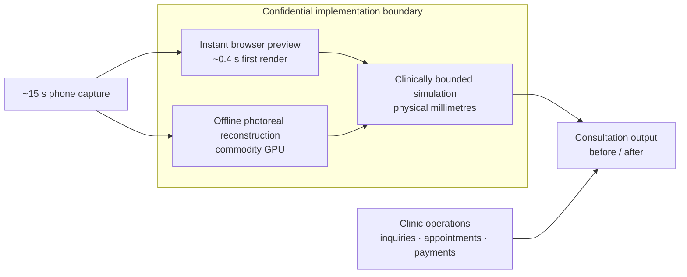

# Case Study — Aura: Photoreal 3D Surgical-Preview & Clinic Platform (private, commercial)

> ### A computer-vision research problem turned into a clinic-ready product by one engineer
>
> | | |
> |---|---|
> | **Status** | **Private, commercial work** — source is not public and will not be |
> | **Scale** | ~800 commits; product, web app, API, ML/GPU workloads and operations tooling |
> | **Headline capability** | Photoreal 3D head from a **~15-second phone capture video** (3D Gaussian Splatting, reconstructed in an offline commodity-GPU job), alongside an **instant in-browser 2.5D preview** (~0.4 s first render) |
> | **Measured quality** | Held-out-frame evaluation: ~27.9 dB PSNR / 0.88 SSIM; automated agreement checks between the instant and offline outputs |
> | **Clinical grounding** | Simulation values expressed in physical millimetres; outputs checked against published facial-anthropometric norms; clinical-reference corpus covers **838 open-access publications** (~2,000 before/after figures) |
> | **Engineering controls** | Reproducible internal measurements, cross-output drift tests, property-based and mutation testing on payment paths |
>
> **Confidentiality boundary.** Implementation details, client identity and commercial IP are
> confidential. This case study documents my responsibilities, engineering scope and non-sensitive
> measurements only.
>
> | Engagement context | |
> |---|---|
> | **Engagement type** | Private commercial development |
> | **Role** | Sole engineer / technical owner — product, frontend, backend, ML/GPU workloads and operations |
> | **Delivery status** | Clinic-ready; source-code delivery package prepared, including release scripts, runbooks and compliance documentation |
> | **Verification available** | Architecture walkthrough and selected non-confidential evidence, under confidentiality |
> | **Confidential** | Client identity, source code, commercial details, internal architecture, algorithms and model/data assets |

> **In plain terms (for non-technical readers).** A patient can see a realistic preview based on
> their own face before deciding on a procedure. A quick version appears in the browser during the
> consultation; a higher-fidelity 3D version is reconstructed offline from a short phone video. The
> clinic's inquiries, appointments, payments and analytics live around that experience in one system.

---

## What this demonstrates

Aura demonstrates **commercial product delivery end-to-end**, **full-stack technical ownership** and
the productization of applied computer vision. The work covered the patient-facing experience, clinic
operations, backend services, data protection, ML/GPU workloads, release packaging and operational
handover. The implementation-specific techniques that differentiate the product are intentionally
outside this public document.

## Public system view

This is a capability map, not a deployment or algorithm diagram. All internal algorithms,
architecture, control logic and model/data assets remain confidential.

## Engineering outcomes

### Photoreal reconstruction made operational

The higher-fidelity path accepts a short phone capture and runs unattended on commodity GPU hardware;
it is deliberately separated from the instant browser experience. Quality is evaluated on video
frames excluded from reconstruction, with an average of ~27.9 dB PSNR / 0.88 SSIM in the recorded
evaluation. Each run produces reviewable outputs and measurement reports. Reconstruction internals
and the editing mechanism are withheld.

### Two speeds kept in measurable agreement

The browser path returns its first preview in ~0.4 s while the photoreal result completes later in the
consultation flow. Automated acceptance tests record **0.10–0.45 mm RMS** agreement across twelve
supported procedure categories. No construction, alignment or transformation method is described.

### Clinical references with traceable provenance

Simulation outputs are checked against published facial-anthropometric norms. The clinical-reference
corpus contains **838 open-access publications** and roughly **2,000 before/after figures**, with each
entry traceable by PMCID and screened for commercially compatible use. Dataset and model assets have
a written provenance register, and ambiguous licensing fails closed. The underlying model choices,
preparation steps and formulas are confidential.

### Test discipline across research and money paths

Internal evidence files pair performance measurements with reproduction commands and worst-case
results. Automated tests guard agreement between fast and offline outputs. Payment-amount handling is
covered by unit, property-based and mutation testing, so the tests themselves are challenged with
deliberately injected faults.

### Privacy, operations and handover

Patient-adjacent data handling has documented KVKK controls and HIPAA-aligned safeguards, including
consent and commercial-messaging controls. The delivery package includes operational configuration,
release verification, runbooks, contract checks and end-to-end coverage with accessibility checks.
Exact topology and business flows are withheld.

---

## Intentionally not disclosed

- Client identity, pricing and commercial workflows
- Source code, deployment topology and internal component names
- All proprietary algorithms, control logic and model/data preparation
- Formulas, prompts, internal sequencing and implementation-specific evidence

*A high-level architecture walkthrough and selected non-confidential evidence can be discussed
privately under an appropriate confidentiality agreement. Source code and client IP remain
unavailable.*

`3D Gaussian Splatting` `computer vision` `facial anthropometry` `clinical-literature validation`
`data provenance` `full-stack product delivery` `GPU workloads` `automated testing` `KVKK`
