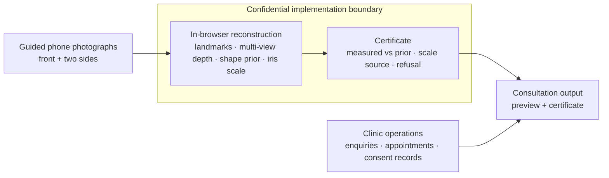

# Case Study — AURA: browser-based facial measurement and surgical-preview platform (private, prototype)

> ### A computer-vision measurement problem taken from research to a working prototype, with the evidence discipline as the product
>
> | | |
> |---|---|
> | **Status** | **Private, my own project — prototype.** No users, no revenue, no clinic yet. The source is not public. |
> | **Scale** | About 2,800 commits (September 2026): the patient-side web application, the clinic workflow, the API, the measurement programme and the operations tooling. |
> | **What it does** | Turns guided phone photographs into a metric three-dimensional face inside the browser, is designed to state region by region what was measured and what was assumed, and to refuse when the evidence is insufficient. |
> | **Accuracy** | **Benchmarked on 10 subjects** from the openly licensed HSRD-100 head-scan collection: the research pipeline reconstructed facial shape to millimetre level across the face and below a millimetre in the nose region (median 0.39 mm, 27 September 2026). These are benchmark results, not a clinical accuracy claim; an independent validation on living faces is the next milestone. |
> | **Engineering controls** | Pre-registered measurements with control arms, worst-case and 95th-percentile reporting, an independent falsification-first review rule for every pull request since September 2026 (a heuristic count on 4 October 2026 finds a recorded review on about 80 to 90 % of merged pull requests), property-based and mutation testing on the payment paths. |
>
> **Authorship and confidentiality.** This is my own project. I design, direct and review every part
> of it. The
> implementation stays closed while intellectual-property work is ongoing. This case study documents
> scope, method, status and dated benchmark results only.
>
> | Context | |
> |---|---|
> | **Ownership** | My own project, held by me |
> | **Role** | Founder and technical owner — product, frontend, backend, measurement programme and operations |
> | **Delivery status** | Working prototype in testing; a source-code delivery package with release scripts, runbooks and compliance documentation exists; zero users |
> | **Verification available** | An architecture walkthrough and selected non-confidential evidence, under confidentiality |
> | **Confidential** | Source code, internal architecture, algorithms, the mechanisms behind the certificate's decisions, and model/data assets |

> **In plain terms (for non-technical readers).** A patient photographs their own face with their
> phone, guided by the browser. In the patient preview the system builds a three-dimensional model on the device and shows the change a physician has planned. Every result is designed to come with a certificate that says which parts were measured and which were assumed, and the system is built to say no when it cannot measure. The
> clinic's enquiries, appointments and consent records live around that experience in one system.

---

## What this demonstrates

AURA demonstrates taking an applied computer-vision problem to a working, testable product surface,
end to end: the patient-facing capture and preview, the clinic operations, the backend, data
protection, a measurement programme run like an experiment, release packaging and an operational
handover package. The techniques that make the certificate's decisions are intentionally outside
this public document.

## Public system view

```mermaid
flowchart LR
    A["Guided phone photographs<br/>front + two sides"]
    F["Clinic operations<br/>enquiries · appointments · consent records"]
    E["Consultation output<br/>preview + certificate"]

    subgraph C["Confidential implementation boundary"]
        B["In-browser reconstruction<br/>landmarks · multi-view depth · shape prior · iris scale"]
        D["Certificate<br/>measured vs prior · scale source · refusal"]
        B --> D
    end

    A --> B
    D --> E
    F --> E
```

This is a capability map, not an algorithm diagram. Internal algorithms, control logic and model/data
assets remain confidential.

## Engineering outcomes

### A reconstruction that runs where the patient is

In the patient preview the reconstruction runs in the browser on the patient's own device, from
landmarks in several views, side-view and silhouette depth, a statistical shape prior used only when
it passes a shape gate, and metric scale from iris statistics or a named population fallback. In the
patient preview, photographs reach the clinic only after the patient's explicit opt-in. A denser
metric pipeline (a self-calibrating sparse bundle adjustment and dense photometric refinement) is
measured in research code beside the product and is not yet in it.

### The certificate is the product

Every capture is designed to receive a certificate: which regions were measured from evidence and
which were filled from the prior, how the metric scale was obtained, and how wide the uncertainty is.
Where the evidence is insufficient the system is designed to refuse to render and ask for a new
capture. Refusal is a feature and its rate is meant to be published beside the accuracy. One known gap
in the prior labelling is filed and will be published with it.

### Measurement run as an experiment

Since September 2026 accuracy measurements are pre-registered before their result is seen: the metric, the bar, the rival
hypothesis and the control arms are written first; the reference surface must score zero error and a
shuffled-identity arm must score chance; results are reported by worst case and 95th percentile, never
by a median alone; a bar that is missed is recorded as missed. So far the pipeline has been measured
against photogrammetric ground truth (rendered head scans) on held-out identities; on real
scanner-rig photographs no bar is met yet, and the record says so. The benchmark figures above come from
this programme; no independent laboratory has confirmed them yet.

### Test discipline across research and money paths

Automated tests run before every sizeable merge, and an end-to-end rehearsal of the patient flow runs
on a seeded stack at acceptance checkpoints. Payment-amount handling is covered by unit, property-based
and mutation testing. Since September 2026 the rule is an independent review before every merge, whose
brief is to falsify the author's claims; a heuristic count on 4 October 2026 finds a recorded review on about
80 to 90 % of merged pull requests.

### Privacy, operations and handover

Patient-adjacent data handling has documented KVKK controls, consent captured as evidence rather than
as a policy promise, and commercial-messaging controls. The delivery package includes operational
configuration, release verification, runbooks and contract checks.

---

## What is not claimed

- No clinical accuracy claim until an independent reference has measured the system on living faces.
- No prediction of a surgical outcome: the preview shows a plan, not a result.
- No certification of regions the photographs did not observe.
- No clinical benefit, no conversion or revenue effect: none has been measured.
- No users, no revenue, no clinic yet.

## Intentionally not disclosed

- Source code, deployment topology and internal component names
- Proprietary algorithms, the mechanisms behind the certificate's decisions, control logic and model/data preparation
- Formulas, prompts, internal sequencing and implementation-specific evidence

*A high-level architecture walkthrough and selected non-confidential evidence can be discussed
privately under an appropriate confidentiality agreement.*

`computer vision` `multi-view geometry` `facial measurement` `pre-registered validation`
`data provenance` `full-stack product delivery` `automated testing` `KVKK`
