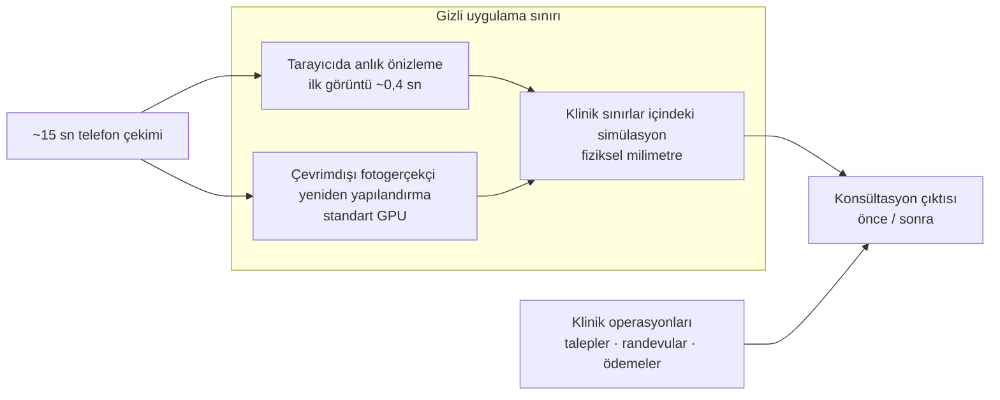

# Vaka Çalışması — Aura: Fotogerçekçi 3D Cerrahi Önizleme ve Klinik Platformu *(özel, ticari)*

> ### Bir bilgisayarlı görü araştırma probleminin tek mühendis tarafından kliniğe hazır ürüne dönüştürülmesi
>
> | | |
> |---|---|
> | **Durum** | **Özel, ticari — kendi ürünüm** — kaynak kod herkese açık değil ve yayımlanmayacak |
> | **Ölçek** | Yaklaşık 800 commit; ürün, web uygulaması, API, ML/GPU iş yükleri ve operasyon araçları |
> | **Ana yetenek** | **Yaklaşık 15 saniyelik telefon çekiminden** fotogerçekçi 3D kafa (3D Gaussian Splatting, standart bir GPU'da çevrimdışı yeniden yapılandırma) ve buna eşlik eden **tarayıcı içi anlık 2.5D önizleme** (ilk görüntü yaklaşık 0,4 saniye) |
> | **Ölçülen kalite** | Yeniden yapılandırmaya dahil edilmeyen karelerde yaklaşık 27,9 dB PSNR / 0,88 SSIM; anlık ve çevrimdışı çıktılar arasında otomatik uyum kontrolleri |
> | **Klinik dayanak** | Simülasyon değerleri fiziksel milimetre cinsinden; çıktılar yayımlanmış yüz antropometrisi normlarıyla kontrol edildi; klinik referans külliyatı **838 açık erişimli yayını** ve yaklaşık 2.000 önce/sonra görselini kapsıyor |
> | **Mühendislik kontrolleri** | Tekrar üretilebilir iç ölçümler, çıktılar arası sapma testleri, ödeme yollarında property-based ve mutation testleri |
>
> **Gizlilik sınırı.** Bu benim kendi ürünüm. Tamamını ben yazdım ve fikrî mülkiyeti bende; devre
> hazırlanıyor — uygulamanın kapalı kalmasının sebebi bu. Bu vaka çalışması yalnızca üstlendiğim
> sorumlulukları, mühendislik kapsamını ve hassas olmayan ölçümleri belgeler.
>
> | Bağlam | |
> |---|---|
> | **Sahiplik** | Kendi ticari ürünüm — tek başıma yazıldı, fikrî mülkiyet bende ve devre hazırlanıyor |
> | **Rol** | Tek mühendis / teknik sahip — ürün, frontend, backend, ML/GPU iş yükleri ve operasyon |
> | **Teslim durumu** | Kliniğe hazır; sürüm betikleri, runbook'lar ve uyum belgelerini içeren kaynak kod teslim paketi hazırlandı |
> | **Sunulabilen doğrulama** | Gizlilik koşuluyla mimari anlatım ve seçilmiş, gizli olmayan kanıtlar |
> | **Gizli tutulanlar** | Kaynak kod, ticari ayrıntılar, iç mimari, algoritmalar ve model/veri varlıkları |

> **Teknik olmayan kısa anlatım.** Hasta, bir işleme karar vermeden önce kendi yüzü üzerinden
> hazırlanmış gerçekçi bir önizleme görebiliyor. Konsültasyon sırasında hızlı sürüm tarayıcıda hemen
> açılıyor; daha yüksek kaliteli 3D sürüm ise kısa bir telefon videosundan çevrimdışı hazırlanıyor.
> Kliniğin talepleri, randevuları, ödemeleri ve analitiği de bu deneyimin çevresinde aynı sistemde
> yönetiliyor.

---

## Bu çalışma neyi gösteriyor?

Aura; **ticari bir ürünün uçtan uca teslimini**, **full-stack teknik sahipliği** ve uygulamalı
bilgisayarlı görünün ürüne dönüştürülmesini gösteriyor. Çalışma; hastanın kullandığı deneyimi, klinik
operasyonlarını, backend servislerini, veri korumayı, ML/GPU iş yüklerini, sürüm paketini ve
operasyonel devri kapsadı. Ürünü farklılaştıran uygulamaya özgü yöntemler bu herkese açık belgenin
bilinçli olarak dışında tutuluyor.

## Herkese açık sistem görünümü

Bu diyagram bir yetenek haritasıdır; dağıtım veya algoritma şeması değildir. İç algoritmalar,
mimari, kontrol mantığı ve model/veri varlıkları gizli kalır.

## Mühendislik sonuçları

### Fotogerçekçi yeniden yapılandırmanın çalıştırılabilir ürüne dönüşmesi

Yüksek kaliteli yol, kısa telefon çekimini alıp standart GPU donanımında gözetimsiz çalışır; tarayıcı
içindeki anlık deneyimden bilinçli olarak ayrılmıştır. Kalite, yeniden yapılandırmada kullanılmayan
video karelerinde ölçüldü; kaydedilen değerlendirmede ortalama yaklaşık 27,9 dB PSNR / 0,88 SSIM
elde edildi. Her çalışma, incelenebilir çıktılar ve ölçüm raporları üretir. Yeniden yapılandırmanın
iç işleyişi ve düzenleme mekanizması açıklanmıyor.

### İki farklı hızın ölçülebilir biçimde uyumlu tutulması

Tarayıcı yolu ilk önizlemeyi yaklaşık 0,4 saniyede verirken fotogerçekçi sonuç konsültasyon akışının
ilerleyen bölümünde tamamlanır. Otomatik kabul testleri, desteklenen on iki işlem kategorisinde
**0,10–0,45 mm RMS** uyum kaydeder. Oluşturma, hizalama veya dönüşüm yöntemleri açıklanmıyor.

### Kaynağı izlenebilen klinik referanslar

Simülasyon çıktıları, yayımlanmış yüz antropometrisi normlarıyla karşılaştırılır. Klinik referans
külliyatı **838 açık erişimli yayın** ve yaklaşık **2.000 önce/sonra görseli** içerir. Her kayıt PMCID
üzerinden izlenebilir ve ticari kullanımla uyumluluk açısından taranmıştır. Veri setleri ve model
varlıkları için yazılı bir köken kaydı tutulur; lisans durumu belirsiz içerik kabul edilmez. Kullanılan
model seçimleri, hazırlık adımları ve formüller gizlidir.

### Araştırma ve ödeme yollarında test disiplini

İç kanıt dosyalarında performans ölçümleri, tekrar üretme komutları ve en kötü durum sonuçları birlikte
tutulur. Otomatik testler, hızlı ve çevrimdışı çıktılar arasındaki uyumu korur. Ödeme tutarlarının
işlenmesi birim, property-based ve mutation testleriyle kapsanır; böylece testlerin kendisi de bilerek
eklenen hatalarla sınanır.

### Gizlilik, operasyon ve devir

Hasta verisiyle ilişkili işlemler için KVKK kontrolleri ve HIPAA ile uyumlu korumalar belgelenmiştir;
bunlara açık rıza ve ticari ileti izinleri de dahildir. Teslim paketi; operasyon ayarlarını, sürüm
doğrulamasını, runbook'ları, sözleşme testlerini ve erişilebilirlik kontrolleri içeren uçtan uca test
kapsamını barındırır. Dağıtım topolojisi ve ticari iş akışlarının ayrıntıları açıklanmıyor.

---

## Bilinçli olarak açıklanmayanlar

- Fiyatlandırma ve ticari iş akışları
- Kaynak kod, dağıtım topolojisi ve iç bileşen adları
- Ürüne özgü algoritmaların, kontrol mantığının ve model/veri hazırlığının tamamı
- Formüller, prompt'lar, iç sıralama ve uygulamaya özgü kanıtlar

*Üst düzey mimari anlatım ve seçilmiş, gizli olmayan kanıtlar uygun bir gizlilik sözleşmesi altında
özel olarak görüşülebilir. Kaynak kod ve devre konu fikrî mülkiyet paylaşılmaz.*

`3D Gaussian Splatting` `bilgisayarlı görü` `yüz antropometrisi` `klinik literatür doğrulaması`
`veri kökeni` `uçtan uca ürün teslimi` `GPU iş yükleri` `otomatik testler` `KVKK`
