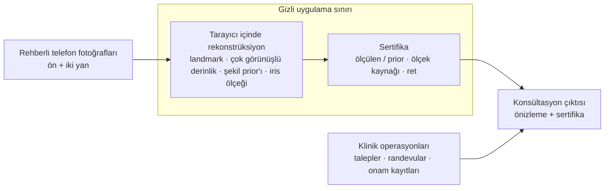

# Vaka çalışması: AURA, tarayıcı tabanlı yüz ölçümü ve cerrahi önizleme platformu (özel, prototip)

> | | |
> |---|---|
> | Durum | Özel bir araştırma prototipi, kendi projem. Henüz kullanıcı, gelir ve klinik yok. Kaynak kod herkese açık değil. |
> | Ölçek | Yaklaşık 2.800 commit (Eylül 2026): hasta tarafındaki web uygulaması, klinik iş akışı, API, ölçüm programı ve operasyon araçları. |
> | Ne yapar | Rehberli telefon fotoğraflarını tarayıcı içinde metrik bir üç boyutlu yüze dönüştürür. Bölge bölge neyin ölçüldüğünü, neyin varsayıldığını söylemek ve kanıt yetersizse reddetmek üzere tasarlandı. |
> | Doğruluk | Açık lisanslı HSRD-100 kafa taraması koleksiyonunun held-out beş kimliğinde (iki kimlik daha ayar için kullanıldı; üç kimlik reddedildi ve başarısız sayıldı), ön kayda alınmış yedi koldan iki çıtayı da karşılayan tek kol burun bölgesinde %81 kapsamla 0,29 mm medyana ve 1,8 mm 95. yüzdeliğe, yüzün tamamında ise %75 kapsamla 1,5 mm 95. yüzdeliğe ulaştı (27 Eylül 2026). Girdiler render edilmiş taramalardı ve ölçek referansa fit edildi. Bunlar karşılaştırma ölçümleri; klinik doğruluk iddiası taşımıyor. Yaşayan yüzlerde bağımsız doğrulama bir sonraki kilometre taşı. |
> | Mühendislik kontrolleri | Kontrol kollu ön kayıtlı ölçümler; en kötü durum ve 95. yüzdelikle raporlama; Eylül 2026'dan bu yana her pull request için inceleme kuralı (4 Ekim 2026'daki sezgisel bir sayımda birleştirilen PR'ların yaklaşık %80–90'ında kaydedilmiş inceleme bulundu); ödeme yollarında property-based ve mutation testleri. |
>
> Proje kapsamı ve gizlilik: Bu benim kendi projem; teknik yön, mimari ve inceleme benim
> sorumluluğumda. Fikrî mülkiyet çalışması sürdüğü için uygulama kapalı tutuluyor. Bu vaka çalışması
> kapsamı, yöntemleri, mevcut durumu ve tarihli ölçüm sonuçlarını anlatıyor.
>
> | Bağlam | |
> |---|---|
> | Sahiplik | Kendi projem, bende |
> | Rol | Kurucu ve teknik sahip: ürün, frontend, backend, ölçüm programı ve operasyon |
> | Teslim durumu | Testte çalışan bir prototip; sürüm betikleri, runbook'lar ve uyum belgelerini içeren bir kaynak kod teslim paketi mevcut; sıfır kullanıcı |
> | Sunulabilen doğrulama | Gizlilik koşuluyla mimari anlatım ve seçilmiş, gizli olmayan kanıtlar |
> | Gizli tutulanlar | Kaynak kod, iç mimari, algoritmalar, sertifikanın kararlarının arkasındaki mekanizmalar ve model/veri varlıkları |

> Teknik olmayan okurlar için kısaca: Hasta, tarayıcının yönlendirmesiyle kendi yüzünü telefonuyla
> fotoğraflar. Hasta önizlemesinde sistem üç boyutlu modeli cihazın üzerinde kurar ve hekimin
> planladığı değişikliği gösterir. Her sonuç, hangi bölgelerin ölçüldüğünü, hangilerinin
> varsayıldığını söyleyen bir sertifikayla gelecek şekilde tasarlandı; sistem ölçemediğinde hayır
> diyecek şekilde kuruldu. Kliniğin talepleri, randevuları ve onam kayıtları da bu deneyimin
> çevresinde, aynı sistemde yönetilir.

## Proje neleri kapsıyor?

AURA, uygulamalı bir bilgisayarlı görü problemini uçtan uca, çalışan ve test edilebilir bir ürün
yüzeyine kadar taşıyor: hastanın kullandığı çekim ve önizleme, klinik operasyonları, backend, veri
koruma, deney gibi yürütülen bir ölçüm programı, sürüm paketi ve operasyonel devir paketi.
Sertifikanın kararlarını veren yöntemler bu herkese açık belgenin dışında bırakıldı.

## Herkese açık sistem görünümü

```mermaid
flowchart LR
    A["Rehberli telefon fotoğrafları<br/>ön + iki yan"]
    F["Klinik operasyonları<br/>talepler · randevular · onam kayıtları"]
    E["Konsültasyon çıktısı<br/>önizleme + sertifika"]

    subgraph C["Gizli uygulama sınırı"]
        B["Tarayıcı içinde rekonstrüksiyon<br/>landmark · çok görünüşlü derinlik · şekil prior'ı · iris ölçeği"]
        D["Sertifika<br/>ölçülen / prior · ölçek kaynağı · ret"]
        B --> D
    end

    A --> B
    D --> E
    F --> E
```

Şema yalnızca yetenekleri gösteriyor. İç algoritmalar, kontrol mantığı ve model/veri varlıkları
gizli.

## Mühendislik sonuçları

### Hastanın olduğu yerde çalışan bir rekonstrüksiyon

Hasta önizlemesinde rekonstrüksiyon, hastanın kendi cihazında, tarayıcıda çalışır. Birden çok
görünüşten landmark'lar, yan görünüş ve silüet derinliği, istatistiksel bir şekil prior'ı (yalnızca
şekil kapısını geçtiğinde) ve iris istatistiğinden ya da adı yazılan bir nüfus tabanlı yedekten gelen
metrik ölçek kullanır. Hasta önizlemesinde fotoğraflar kliniğe yalnızca hastanın açık onayından sonra
ulaşır. Daha yoğun bir metrik hat (kendini kalibre eden seyrek bundle adjustment ve yoğun fotometrik
iyileştirme) ürünün yanında, araştırma kodunda ölçülüyor; henüz üründe yok.

### Sertifika

Her çekim bir sertifika alacak şekilde tasarlandı: hangi bölgeler kanıttan ölçüldü, hangileri
prior'dan dolduruldu, metrik ölçek nasıl elde edildi ve belirsizlik ne kadar geniş. Kanıt yetersizse
sistem göstermeyi reddedecek ve yeni bir çekim isteyecek şekilde tasarlandı. Ret oranının doğrulukla
birlikte yayımlanması amaçlanıyor. Prior etiketlemesindeki bilinen bir boşluk kayıtlı ve onunla
birlikte yayımlanacak.

### Deney gibi yürütülen ölçüm

Eylül 2026'dan bu yana doğruluk ölçümleri, sonucu görülmeden önce ön kayda alınıyor. Ölçüt, çıta,
rakip hipotez ve kontrol kolları önce yazılır; referans yüzey sıfır hata, kimlikleri karıştırılmış kol
ise şans düzeyi vermelidir. Sonuçlar en kötü durum ve 95. yüzdelikle bildirilir, medyan hiçbir zaman
tek başına verilmez; tutmayan çıta "tutmadı" diye kaydedilir. Hat bugüne kadar held-out kimliklerde
fotogrametrik referansa (taranmış kafaların render'ları) karşı ölçüldü. Gerçek tarama düzeneği
fotoğraflarında henüz hiçbir çıta tutmadı ve kayıt bunu söylüyor. Yukarıdaki karşılaştırma değerleri
bu programdan geliyor; bağımsız bir laboratuvar onları henüz doğrulamadı.

### Araştırma ve para yollarında test disiplini

Otomatik testler her büyük birleştirmeden önce koşar; hasta akışının uçtan uca provası kabul
noktalarında seed'li bir ortamda yürütülür. Ödeme tutarlarını işleyen kod birim, property-based ve
mutation testleriyle sınanıyor. Eylül 2026'dan bu yana her birleştirmenin kayıtlı bir
incelemesi olması hedefleniyor; 4 Ekim 2026'daki sezgisel bir sayımda birleştirilen PR'ların yaklaşık
%80–90'ında inceleme kaydı bulundu.

### Gizlilik, operasyon ve devir

Hastaya yakın veri işlemede belgelenmiş KVKK kontrolleri ve ticari ileti kontrolleri var; onam kanıt
olarak kaydediliyor. Teslim paketi operasyonel yapılandırmayı, sürüm doğrulamasını, runbook'ları ve
sözleşme kontrollerini içeriyor.

## İddia edilmeyenler

- Bağımsız bir referans sistemi yaşayan yüzlerde ölçene kadar klinik doğruluk iddiası yok.
- Cerrahi sonuç tahmini yok. Önizleme bir planı gösterir, sonucu tahmin etmez.
- Fotoğrafların gözlemlemediği bölgeler için sertifika yok.
- Klinik fayda, dönüşüm ve gelir etkisi ölçülmedi; bu yüzden hiçbiri iddia edilmiyor.
- Henüz kullanıcı, gelir ve klinik yok.

## Açıklanmayanlar

- Kaynak kod, dağıtım topolojisi ve iç bileşen adları
- Özel algoritmalar, sertifikanın kararlarının arkasındaki mekanizmalar, kontrol mantığı ve model/veri hazırlığı
- Formüller, iç sıralama ve uygulamaya özgü kanıtlar

*Üst düzey bir mimari anlatım ve seçilmiş, gizli olmayan kanıtlar uygun bir gizlilik sözleşmesi
altında özel olarak görüşülebilir.*

`bilgisayarlı görü` `çok görünüşlü geometri` `yüz ölçümü` `ön kayıtlı doğrulama` `veri kökeni`
`full-stack ürün teslimi` `otomatik test` `KVKK`
