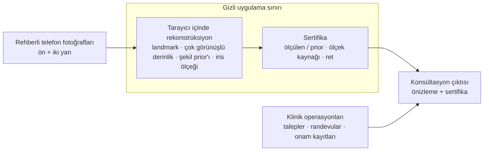

# Vaka Çalışması — AURA: tarayıcı tabanlı yüz ölçümü ve cerrahi önizleme platformu *(özel, prototip)*

> ### Bir bilgisayarlı görü ölçüm probleminin araştırmadan çalışan bir prototipe taşınması; ürün, kanıt disiplininin kendisidir
>
> | | |
> |---|---|
> | **Durum** | **Özel, kendi projem — prototip.** Henüz kullanıcı, gelir ve klinik yok. Kaynak kod herkese açık değil. |
> | **Ölçek** | Yaklaşık 2.800 commit (Eylül 2026): hasta tarafındaki web uygulaması, klinik iş akışı, API, ölçüm programı ve operasyon araçları. |
> | **Ne yapar** | Rehberli telefon fotoğraflarını tarayıcı içinde metrik bir üç boyutlu yüze dönüştürür; bölge bölge neyin ölçüldüğünü, neyin varsayıldığını söylemek ve kanıt yetersizse reddetmek üzere tasarlanmıştır. |
> | **Doğruluk** | **10 kişi üzerinde ölçüldü**: açık lisanslı HSRD-100 kafa taraması koleksiyonundaki 10 kişide araştırma hattı yüz şeklini yüzün genelinde milimetre düzeyinde, burun bölgesinde milimetrenin altında kurdu (medyan 0,39 mm, 27 Eylül 2026). Bunlar karşılaştırma ölçümleridir, klinik doğruluk iddiası değildir; yaşayan yüzlerde bağımsız doğrulama bir sonraki kilometre taşıdır. |
> | **Mühendislik kontrolleri** | Kontrol kollu ön kayıtlı ölçümler; en kötü durum ve yüzde doksan beşinci yüzdelikle raporlama; Eylül 2026'dan bu yana her pull request'te bağımsız, yanlışlamaya odaklı inceleme; ödeme yollarında property-based ve mutation testleri. |
>
> **Yazarlık ve gizlilik.** Bu benim kendi projem. Her parçasını ben tasarlıyor, yönlendiriyor ve
> inceliyorum. Fikrî mülkiyet çalışması sürdüğü için uygulama kapalı tutuluyor. Bu vaka
> çalışması yalnızca kapsamı, yöntemi, durumu ve tarihli karşılaştırma sonuçlarını belgeler.
>
> | Bağlam | |
> |---|---|
> | **Sahiplik** | Kendi projem, bende |
> | **Rol** | Kurucu ve teknik sahip — ürün, frontend, backend, ölçüm programı ve operasyon |
> | **Teslim durumu** | Testte çalışan bir prototip; sürüm betikleri, runbook'lar ve uyum belgelerini içeren bir kaynak kod teslim paketi mevcut; sıfır kullanıcı |
> | **Sunulabilen doğrulama** | Gizlilik koşuluyla mimari anlatım ve seçilmiş, gizli olmayan kanıtlar |
> | **Gizli tutulanlar** | Kaynak kod, iç mimari, algoritmalar, sertifikanın kararlarının arkasındaki mekanizmalar ve model/veri varlıkları |

> **Teknik olmayan kısa anlatım.** Hasta, tarayıcının yönlendirmesiyle kendi yüzünü telefonuyla
> fotoğraflar. Hasta önizlemesinde sistem üç boyutlu modeli cihazın üzerinde kurar ve hekimin planladığı değişikliği gösterir. Her sonuç, hangi bölgelerin ölçüldüğünü, hangilerinin varsayıldığını söyleyen bir sertifikayla gelmek üzere tasarlanmıştır; sistem ölçemediğinde hayır demek üzere kurulmuştur. Kliniğin talepleri,
> randevuları ve onam kayıtları bu deneyimin çevresinde aynı sistemde yönetilir.

---

## Bu çalışma neyi gösteriyor?

AURA, uygulamalı bir bilgisayarlı görü probleminin çalışan ve test edilebilir bir ürün yüzeyine uçtan
uca taşınmasını gösterir: hastanın kullandığı çekim ve önizleme, klinik operasyonları, backend, veri
koruma, deney gibi yürütülen bir ölçüm programı, sürüm paketi ve operasyonel devir paketi.
Sertifikanın kararlarını veren yöntemler bilinçli olarak bu herkese açık belgenin dışındadır.

## Herkese açık sistem görünümü

```mermaid
flowchart LR
    A["Rehberli telefon fotoğrafları<br/>ön + iki yan"]
    F["Klinik operasyonları<br/>talepler · randevular · onam kayıtları"]
    E["Konsültasyon çıktısı<br/>önizleme + sertifika"]

    subgraph C["Gizli uygulama sınırı"]
        B["Tarayıcı içinde rekonstrüksiyon<br/>landmark · çok görünüşlü derinlik · şekil prior'ı · iris ölçeği"]
        D["Sertifika<br/>ölçülen / prior · ölçek kaynağı · ret"]
        B --> D
    end

    A --> B
    D --> E
    F --> E
```

Bu bir yetenek haritasıdır, algoritma şeması değildir. İç algoritmalar, kontrol mantığı ve model/veri
varlıkları gizlidir.

## Mühendislik sonuçları

### Hastanın olduğu yerde çalışan bir rekonstrüksiyon

Hasta önizlemesinde rekonstrüksiyon, hastanın kendi cihazında, tarayıcıda çalışır: birden çok
görünüşten landmark'lar, yan görünüş ve silüet derinliği, yalnızca şekil kapısını geçtiğinde kullanılan
istatistiksel bir şekil prior'ı ve iris istatistiğinden ya da adı yazılan bir nüfus tabanlı yedekten
gelen metrik ölçek. Hasta önizlemesinde fotoğraflar kliniğe yalnızca hastanın açık onayından sonra
ulaşır. Daha yoğun bir metrik hat (kendini kalibre eden seyrek bundle adjustment ve yoğun fotometrik
iyileştirme) ürünün yanında araştırma kodunda ölçülmektedir ve henüz üründe değildir.

### Ürün sertifikadır

Her çekim bir sertifika almak üzere tasarlanmıştır: hangi bölgeler kanıttan ölçüldü, hangileri
prior'dan dolduruldu, metrik ölçek nasıl elde edildi ve belirsizlik ne kadar geniş. Kanıt yetersizse
sistem göstermeyi reddetmek ve yeni bir çekim istemek üzere tasarlanmıştır. Ret bir özelliktir ve oranı
doğrulukla birlikte yayımlanacaktır. Prior etiketlemesindeki bilinen bir boşluk kayıtlıdır ve onunla
birlikte yayımlanacaktır.

### Deney gibi yürütülen ölçüm

Eylül 2026'dan bu yana doğruluk ölçümleri, sonucu görülmeden önce ön kayda alınır: ölçüt, çıta, rakip hipotez ve kontrol
kolları önce yazılır; referans yüzey sıfır hata, kimlikleri karıştırılmış kol şans düzeyi okumalıdır;
sonuçlar en kötü durum ve yüzde doksan beşinci yüzdelikle bildirilir, hiçbir zaman tek başına
medyanla değil; tutmayan çıta tutmadı diye kaydedilir. Hat bugüne kadar held-out kimliklerde
fotogrametrik referansa (taranmış kafaların render'ları) karşı ölçülmüştür; gerçek tarayıcı rig'i
fotoğraflarında henüz hiçbir çıta tutmamıştır ve kayıt bunu söyler. Yukarıdaki karşılaştırma değerleri
bu programdan gelir; bağımsız bir laboratuvar onları henüz doğrulamadı.

### Araştırma ve para yollarında test disiplini

Otomatik testler her büyük birleştirmeden önce koşar; hasta akışının uçtan uca provası kabul
noktalarında tohumlanmış bir yığın üzerinde yürütülür. Ödeme tutarı işleme birim, property-based ve
mutation testleriyle kapsanır. Eylül 2026'dan bu yana her pull request, görevi yazarın iddialarını
yanlışlamak olan bağımsız bir incelemeden geçer.

### Gizlilik, operasyon ve devir

Hastaya yakın veri işleme belgelenmiş KVKK kontrolleri, politika vaadi olarak değil kanıt olarak
alınan onam ve ticari ileti kontrolleri taşır. Teslim paketi operasyonel yapılandırmayı, sürüm
doğrulamasını, runbook'ları ve sözleşme kontrollerini içerir.

---

## İddia edilmeyenler

- Bağımsız bir referans sistemi yaşayan yüzlerde ölçmeden hiçbir klinik doğruluk iddiası.
- Cerrahi sonuç tahmini yok: önizleme bir planı gösterir, bir sonucu değil.
- Fotoğrafların gözlemlemediği bölgeler için sertifika yok.
- Klinik fayda, dönüşüm ya da gelir etkisi iddiası yok: hiçbiri ölçülmedi.
- Henüz kullanıcı, gelir ve klinik yok.

## Bilinçli olarak açıklanmayanlar

- Kaynak kod, dağıtım topolojisi ve iç bileşen adları
- Özel algoritmalar, sertifikanın kararlarının arkasındaki mekanizmalar, kontrol mantığı ve model/veri hazırlığı
- Formüller, istemler, iç sıralama ve uygulamaya özgü kanıtlar

*Üst düzey bir mimari anlatım ve seçilmiş, gizli olmayan kanıtlar uygun bir gizlilik sözleşmesi
altında özel olarak görüşülebilir.*

`bilgisayarlı görü` `çok görünüşlü geometri` `yüz ölçümü` `ön kayıtlı doğrulama` `veri kökeni`
`full-stack ürün teslimi` `otomatik test` `KVKK`
